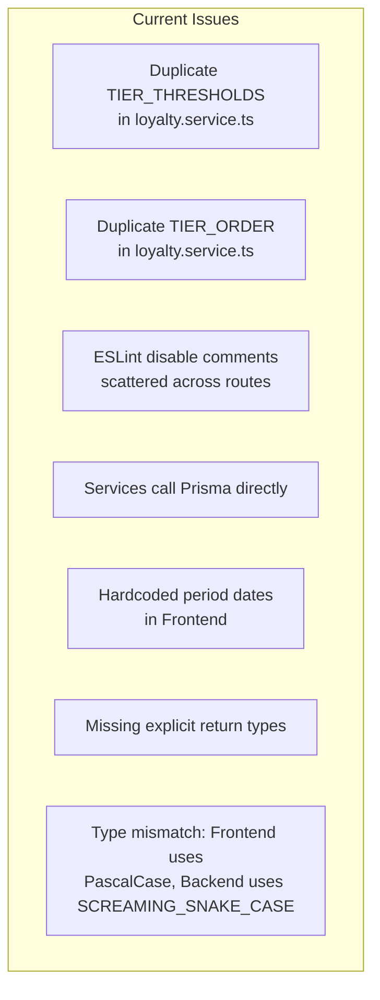
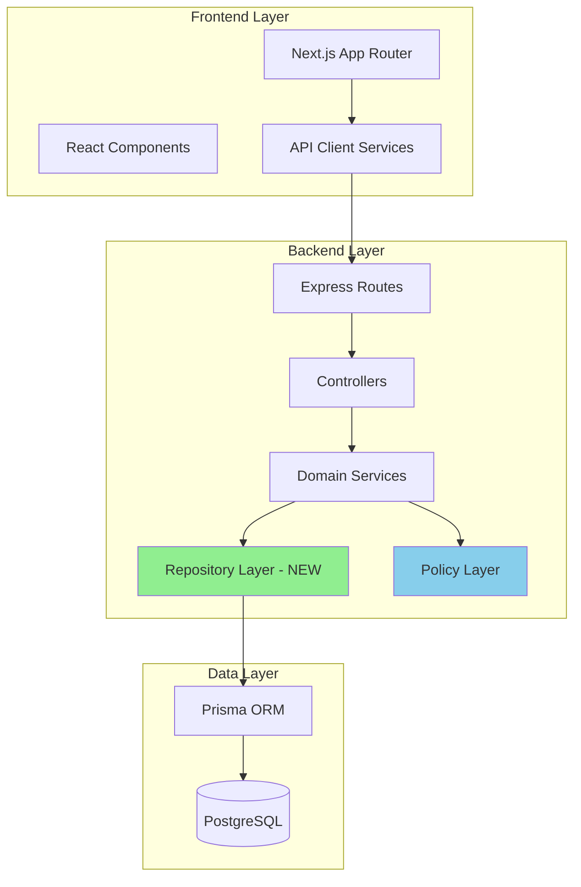
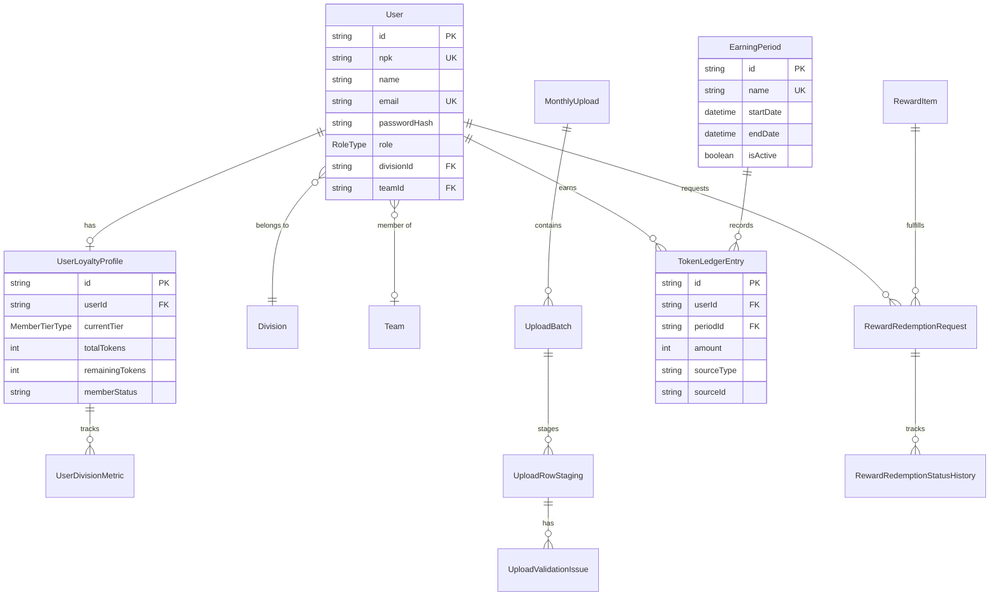
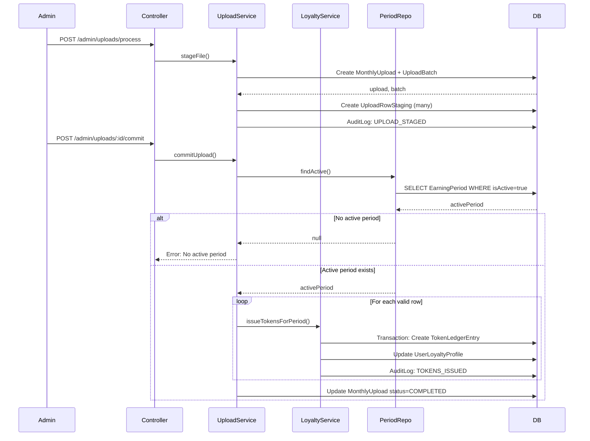
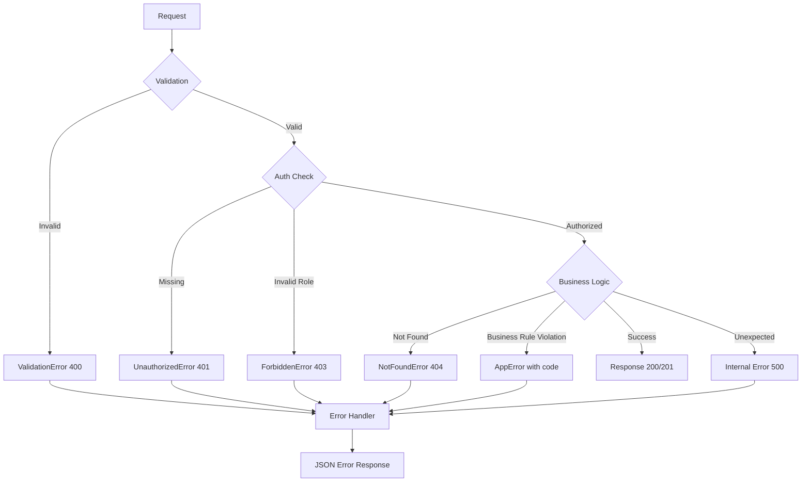

# Design Document: Best Practices Improvements

## Overview

This document outlines the technical design for improving the Berijalan Employee Loyalty Program Portal's Frontend and Backend to adhere to best practices, maintainability, and consistency with AGENTS.md guidelines. The improvements focus on:

1. **Code Quality**: Eliminating duplicate logic, adding explicit types, removing ESLint suppressions
2. **Type Safety**: Unifying type definitions, enabling strict TypeScript compliance
3. **Architecture**: Implementing repository pattern, custom error classes, proper authorization
4. **Data Integrity**: Validating inputs, ensuring proper period ID handling for audit trails

### Key Design Decisions

| Decision | Rationale |
|----------|-----------|
| Single source of truth for tier constants via `loyalty.policy.ts` | DRY principle, prevents configuration drift |
| Repository pattern for data access | Separation of concerns, testability, maintainability |
| Custom error classes with proper inheritance | Consistent error handling, appropriate HTTP status codes |
| Zod validation at controller layer | Fail-fast validation, detailed error messages |
| Remove hardcoded frontend values | UI reflects actual API data, easier maintenance |

---

## Architecture

### Current Architecture Issues



### Target Architecture



### Directory Structure Changes

```
Backend/src/
├── api/                    # Route definitions (no logic)
│   ├── admin.routes.ts
│   ├── employee.routes.ts
│   └── leader.routes.ts
├── controllers/            # HTTP handlers (validation + response)
│   ├── loyalty.controller.ts
│   ├── redemption.controller.ts
│   └── upload.controller.ts
├── services/               # Business logic
│   ├── loyalty.service.ts
│   ├── loyalty-calculation.service.ts
│   ├── redemption.service.ts
│   ├── upload.service.ts
│   └── audit.service.ts
├── repositories/           # NEW: Data access layer
│   ├── user.repository.ts
│   ├── redemption.repository.ts
│   ├── upload.repository.ts
│   └── period.repository.ts
├── policies/               # Business rules/constants
│   └── loyalty.policy.ts
├── middleware/
│   ├── authenticate.ts
│   ├── authorize.ts
│   └── error-handler.ts
├── errors/                 # NEW: Custom error classes
│   ├── index.ts
│   ├── app-error.ts
│   ├── validation-error.ts
│   ├── not-found-error.ts
│   └── unauthorized-error.ts
├── types/
│   ├── domain.types.ts
│   ├── api.types.ts
│   └── validations.ts
└── utils/
    └── file-parser.ts
```

---

## Components and Interfaces

### 1. Repository Layer (New)

The repository layer abstracts Prisma queries, making services easier to test and maintain.

#### 1.1 UserRepository

```typescript
// repositories/user.repository.ts
import type { PrismaClient, User, UserLoyaltyProfile } from "@prisma/client";

export class UserRepository {
  constructor(private readonly prisma: PrismaClient) {}

  async findById(userId: string): Promise<User | null> {
    return this.prisma.user.findUnique({ where: { id: userId } });
  }

  async findByNpk(npk: string): Promise<User | null> {
    return this.prisma.user.findUnique({ where: { npk } });
  }

  async upsertByNpk(npk: string, data: { name: string; email: string }): Promise<User> {
    return this.prisma.user.upsert({
      where: { npk },
      create: { npk, ...data, passwordHash: "hashed_placeholder", role: "MITRA" },
      update: { name: data.name },
    });
  }

  async getLoyaltyProfile(userId: string): Promise<UserLoyaltyProfile | null> {
    return this.prisma.userLoyaltyProfile.findUnique({ where: { userId } });
  }

  async getTeamMembers(teamId: string): Promise<User[]> {
    return this.prisma.user.findMany({
      where: { teamId, role: "MITRA" },
      select: {
        id: true, name: true, npk: true,
        division: { select: { name: true, type: true } },
        loyaltyProfile: { select: { totalTokens: true, currentTier: true, memberStatus: true } },
      },
    });
  }
}
```

#### 1.2 RedemptionRepository

```typescript
// repositories/redemption.repository.ts
import type { PrismaClient, RewardRedemptionRequest, RedemptionStatus } from "@prisma/client";

export class RedemptionRepository {
  constructor(private readonly prisma: PrismaClient) {}

  async findAll(): Promise<RewardRedemptionRequest[]> {
    return this.prisma.rewardRedemptionRequest.findMany({
      include: {
        user: { select: { id: true, name: true, npk: true } },
        item: { select: { id: true, name: true, tokenCost: true } },
        history: { orderBy: { createdAt: "desc" }, take: 1 },
      },
      orderBy: { createdAt: "desc" },
    });
  }

  async findById(requestId: string): Promise<RewardRedemptionRequest | null> {
    return this.prisma.rewardRedemptionRequest.findUnique({
      where: { id: requestId },
      include: {
        user: { select: { id: true, name: true, npk: true } },
        item: { select: { id: true, name: true, tokenCost: true } },
        history: { orderBy: { createdAt: "desc" } },
      },
    });
  }

  async findByUserId(userId: string): Promise<RewardRedemptionRequest[]> {
    return this.prisma.rewardRedemptionRequest.findMany({
      where: { userId },
      include: {
        item: { select: { id: true, name: true, tokenCost: true, imageUrl: true } },
        history: { orderBy: { createdAt: "desc" } },
      },
      orderBy: { createdAt: "desc" },
    });
  }

  async create(data: { userId: string; rewardItemId: string; tokensSpent: number; status: RedemptionStatus }): Promise<RewardRedemptionRequest> {
    return this.prisma.rewardRedemptionRequest.create({ data });
  }
}
```

#### 1.3 UploadRepository

```typescript
// repositories/upload.repository.ts
import type { PrismaClient, MonthlyUpload, UploadBatch, UploadRowStaging } from "@prisma/client";

export class UploadRepository {
  constructor(private readonly prisma: PrismaClient) {}

  async findAll(): Promise<MonthlyUpload[]> {
    return this.prisma.monthlyUpload.findMany({
      orderBy: { createdAt: "desc" },
      include: { batches: { select: { totalRows: true } } },
    });
  }

  async findById(uploadId: string): Promise<MonthlyUpload | null> {
    return this.prisma.monthlyUpload.findUnique({
      where: { id: uploadId },
      include: { batches: { include: { stagingRows: { include: { issues: true } } } } },
    });
  }

  async create(data: { filename: string; divisionType: string; uploadedById: string }): Promise<MonthlyUpload> {
    return this.prisma.monthlyUpload.create({ data });
  }
}
```

#### 1.4 PeriodRepository

```typescript
// repositories/period.repository.ts
import type { PrismaClient, EarningPeriod } from "@prisma/client";

export class PeriodRepository {
  constructor(private readonly prisma: PrismaClient) {}

  async findActive(): Promise<EarningPeriod | null> {
    return this.prisma.earningPeriod.findFirst({ where: { isActive: true } });
  }

  async findById(periodId: string): Promise<EarningPeriod | null> {
    return this.prisma.earningPeriod.findUnique({ where: { id: periodId } });
  }
}
```

### 2. Custom Error Classes (New)

#### 2.1 Error Class Hierarchy

```typescript
// errors/app-error.ts
export abstract class AppError extends Error {
  public readonly statusCode: number;
  public readonly code: string;

  constructor(message: string, statusCode: number, code: string) {
    super(message);
    this.statusCode = statusCode;
    this.code = code;
    Error.captureStackTrace(this, this.constructor);
  }
}

// errors/validation-error.ts
export class ValidationError extends AppError {
  constructor(message: string, public readonly details?: Record<string, unknown>) {
    super(message, 400, "VALIDATION_ERROR");
  }
}

// errors/not-found-error.ts
export class NotFoundError extends AppError {
  constructor(resource: string, identifier?: string) {
    super(
      identifier ? `${resource} with identifier '${identifier}' not found` : `${resource} not found`,
      404,
      "NOT_FOUND"
    );
  }
}

// errors/unauthorized-error.ts
export class UnauthorizedError extends AppError {
  constructor(message: string = "Unauthorized access") {
    super(message, 401, "UNAUTHORIZED");
  }
}

// errors/forbidden-error.ts
export class ForbiddenError extends AppError {
  constructor(message: string = "Access denied") {
    super(message, 403, "FORBIDDEN");
  }
}

// errors/index.ts
export { AppError } from "./app-error";
export { ValidationError } from "./validation-error";
export { NotFoundError } from "./not-found-error";
export { UnauthorizedError } from "./unauthorized-error";
export { ForbiddenError } from "./forbidden-error";
```

### 3. Updated Error Handler Middleware

```typescript
// middleware/error-handler.ts
import type { ErrorRequestHandler } from "express";
import { AppError, ValidationError, NotFoundError, UnauthorizedError, ForbiddenError } from "@/errors";

export const errorHandler: ErrorRequestHandler = (err, _req, res, _next) => {
  const isDev = process.env.NODE_ENV === "development";

  // Handle known error types
  if (err instanceof ValidationError) {
    res.status(err.statusCode).json({
      error: err.message,
      code: err.code,
      details: err.details,
    });
    return;
  }

  if (err instanceof NotFoundError) {
    res.status(err.statusCode).json({
      error: err.message,
      code: err.code,
    });
    return;
  }

  if (err instanceof UnauthorizedError || err instanceof ForbiddenError) {
    res.status(err.statusCode).json({
      error: err.message,
      code: err.code,
    });
    return;
  }

  if (err instanceof AppError) {
    res.status(err.statusCode).json({
      error: err.message,
      code: err.code,
    });
    return;
  }

  // Unknown error - log and return generic message
  console.error(`[ErrorHandler] Unhandled error:`, isDev ? err.stack : err.message);
  res.status(500).json({
    error: "Internal server error",
    code: "INTERNAL_ERROR",
    ...(isDev && { stack: err.stack }),
  });
};
```

### 4. Updated Loyalty Service (Single Source of Truth)

```typescript
// services/loyalty.service.ts
/**
 * Loyalty Engine — Domain Services
 * 
 * IMPORTANT: All tier thresholds and calculations are imported from
 * policies/loyalty.policy.ts - the single source of truth.
 */

import type { MemberTierType } from "@prisma/client";
import { LOYALTY_POLICIES } from "@/policies/loyalty.policy";

type TierStatus = MemberTierType;

// Re-export from policy for backward compatibility
export const TIER_THRESHOLDS = LOYALTY_POLICIES.TIER_THRESHOLDS;
export const TIER_ORDER = LOYALTY_POLICIES.TIER_ORDER;
export const REDEMPTION_ELIGIBILITY_THRESHOLD = LOYALTY_POLICIES.REDEMPTION_THRESHOLD;

/**
 * Determines the membership tier based on total token count.
 * Delegates to the centralized policy calculation.
 */
export function determineTier(totalTokens: number): TierStatus {
  return LOYALTY_POLICIES.calculateTier(totalTokens);
}

/**
 * Returns the next tier above the current one, or null if already Platinum.
 */
export function getNextTier(current: TierStatus): TierStatus | null {
  const idx = LOYALTY_POLICIES.TIER_ORDER.indexOf(current);
  return idx < LOYALTY_POLICIES.TIER_ORDER.length - 1 
    ? (LOYALTY_POLICIES.TIER_ORDER[idx + 1] as TierStatus) 
    : null;
}

/**
 * Returns the token delta needed to reach the next tier.
 */
export function getPointsToNextTier(totalTokens: number): number {
  const nextTier = getNextTier(determineTier(totalTokens));
  if (!nextTier) return 0;
  return Math.max(0, LOYALTY_POLICIES.TIER_THRESHOLDS[nextTier] - totalTokens);
}

// ... rest of calculation functions unchanged
```

### 5. Service Methods with Explicit Return Types

```typescript
// services/audit.service.ts
import type { Prisma } from "@prisma/client";
import { prisma } from "@/db/prisma";

export type AuditAction = 
  | "UPLOAD_STAGED"
  | "UPLOAD_COMMITTED"
  | "UPLOAD_FAILED"
  | "TOKENS_ISSUED"
  | "REDEMPTION_VERIFIED"
  | "REDEMPTION_REJECTED"
  | "REDEMPTION_CREATED"
  | "REDEMPTION_STATUS_UPDATED"
  | "MANUAL_TOKEN_ADJUSTMENT"
  | "EMPLOYEE_RESIGNED";

interface LogAuditParams {
  action: AuditAction;
  actorId: string;
  targetType: string;
  targetId: string;
  details?: Record<string, unknown>;
  ipAddress?: string;
  tx?: Prisma.TransactionClient;
}

export class AuditService {
  /**
   * Logs an action to the audit trail.
   * @returns Promise<void> - explicit return type
   */
  static async log(params: LogAuditParams): Promise<void> {
    const client = params.tx ?? prisma;
    
    await client.auditLog.create({
      data: {
        action: params.action,
        actorId: params.actorId,
        targetType: params.targetType,
        targetId: params.targetId,
        details: (params.details ?? {}) as Prisma.InputJsonValue,
        ipAddress: params.ipAddress ?? null,
      },
    });
  }
}
```

### 6. Authorization Checks for Team Leader Endpoints

```typescript
// services/loyalty-calculation.service.ts
import { ForbiddenError, NotFoundError } from "@/errors";

export class LoyaltyCalculationService {
  /**
   * Returns a summary of all team members for a leader.
   * @throws ForbiddenError if leader has no team assigned
   */
  static async getTeamSummary(leaderId: string): Promise<TeamMemberSummary[]> {
    const leader = await prisma.user.findUnique({
      where: { id: leaderId },
      select: { teamId: true },
    });

    if (!leader?.teamId) {
      throw new ForbiddenError("You are not assigned to a team");
    }

    const members = await prisma.user.findMany({
      where: { teamId: leader.teamId, role: "MITRA" },
      select: {
        id: true, name: true, npk: true,
        division: { select: { name: true, type: true } },
        loyaltyProfile: {
          select: { totalTokens: true, currentTier: true, memberStatus: true },
        },
      },
    });

    return members.map((m) => ({
      id: m.id,
      name: m.name,
      division: m.division?.type ?? "UNKNOWN",
      tokens: m.loyaltyProfile?.totalTokens ?? 0,
      tier: m.loyaltyProfile?.currentTier ?? "BRONZE",
      status: m.loyaltyProfile?.memberStatus ?? "ACTIVE",
    }));
  }

  /**
   * Returns dashboard data for a specific team member.
   * @throws ForbiddenError if member does not belong to leader's team
   */
  static async getTeamMemberDetail(leaderId: string, memberId: string): Promise<EmployeeDashboardData> {
    // Verify leader has a team
    const leader = await prisma.user.findUnique({
      where: { id: leaderId },
      select: { teamId: true },
    });

    if (!leader?.teamId) {
      throw new ForbiddenError("You are not assigned to a team");
    }

    // Verify member belongs to leader's team
    const member = await prisma.user.findUnique({
      where: { id: memberId },
      select: { teamId: true },
    });

    if (!member) {
      throw new NotFoundError("Employee", memberId);
    }

    if (member.teamId !== leader.teamId) {
      throw new ForbiddenError("This employee is not in your team");
    }

    return this.getEmployeeDashboard(memberId);
  }
}
```

### 7. Controller with Zod Validation

```typescript
// controllers/redemption.controller.ts
import type { RequestHandler } from "express";
import { RedemptionService } from "@/services/redemption.service";
import { redeemRequestSchema, updateStatusSchema, uuidSchema } from "@/types/validations";
import { ValidationError, NotFoundError } from "@/errors";

export const RedemptionController = {
  // POST /api/admin/redemptions/:id/status
  updateStatus: (async (req, res, next) => {
    try {
      // Validate path parameter
      const idParam = req.params["id"];
      if (!idParam || !uuidSchema.safeParse(idParam).success) {
        throw new ValidationError("Invalid request ID format", { requestId: idParam });
      }

      // Validate request body
      const parsed = updateStatusSchema.safeParse(req.body);
      if (!parsed.success) {
        throw new ValidationError("Invalid status parameters", parsed.error.format());
      }

      const { user } = req;
      const result = await RedemptionService.updateStatus(
        idParam,
        parsed.data.status,
        user.id,
        parsed.data.reason
      );

      res.json({
        success: true,
        message: `Status updated to ${parsed.data.status}`,
        request: result,
      });
    } catch (err) {
      next(err);
    }
  }) satisfies RequestHandler,
};
```

### 8. Unified Type Definitions

#### 8.1 Backend Types (Using Prisma Enums)

```typescript
// types/domain.types.ts
import type { RoleType, DivisionType, MemberTierType, RedemptionStatus } from "@prisma/client";

// Re-export Prisma enums for consistency
export type Role = RoleType;
export type Division = DivisionType;
export type TierStatus = MemberTierType;
export type RewardRequestStatus = RedemptionStatus;

// Domain-specific types
export interface TokenSummary {
  userId: string;
  totalTokens: number;
  currentTier: TierStatus;
  pointsToNextTier: number;
  totalForNextTier: number;
  isEligibleForReward: boolean;
  activePeriod: string;
  status: "ACTIVE" | "DOWNGRADED" | "RESET" | "INACTIVE";
}
```

#### 8.2 Frontend Types (Matching Backend)

```typescript
// Frontend/src/types/index.ts
// Types are now generated from backend to ensure consistency
// During build, run a script to copy from Backend/src/types/domain.types.ts

export type Role = "MITRA" | "TEAM_LEADER" | "HC_PM";
export type Division = "OPTEL" | "TECHNO";
export type TierStatus = "BRONZE" | "SILVER" | "GOLD" | "PLATINUM";
export type RewardRequestStatus = 
  | "DRAFT"
  | "PENDING_VERIFICATION"
  | "VERIFIED"
  | "REJECTED"
  | "PURCHASED"
  | "PICKUP_SCHEDULED"
  | "COMPLETED"
  | "CANCELLED";
```

### 9. Period ID Validation for Token Ledger

```typescript
// services/redemption.service.ts
import { NotFoundError, ValidationError } from "@/errors";
import { PeriodRepository } from "@/repositories/period.repository";

export class RedemptionService {
  private static periodRepo = new PeriodRepository(prisma);

  static async updateStatus(
    requestId: string,
    newStatus: RedemptionStatus,
    actorId: string,
    reason?: string
  ): Promise<RewardRedemptionRequest> {
    const request = await prisma.rewardRedemptionRequest.findUnique({
      where: { id: requestId },
      include: { item: true },
    });

    if (!request) {
      throw new NotFoundError("Redemption request", requestId);
    }

    // Validate status transition
    const allowedNextStatuses = this.VALID_TRANSITIONS[request.status];
    if (!allowedNextStatuses.includes(newStatus)) {
      throw new ValidationError(`Invalid transition from ${request.status} to ${newStatus}`);
    }

    const result = await prisma.$transaction(async (tx) => {
      if (newStatus === "VERIFIED") {
        // Fetch active period before creating ledger entry
        const activePeriod = await this.periodRepo.findActive();
        if (!activePeriod) {
          throw new ValidationError("No active earning period found. Cannot process redemption.");
        }

        await tx.tokenLedgerEntry.create({
          data: {
            userId: request.userId,
            amount: -request.tokensSpent,
            sourceType: "REDEMPTION",
            sourceId: requestId,
            periodId: activePeriod.id, // Use validated period ID
          },
        });

        await tx.userLoyaltyProfile.update({
          where: { userId: request.userId },
          data: { remainingTokens: { decrement: request.tokensSpent } },
        });
      }

      // ... rest of transaction
    });

    return result;
  }
}
```

---

## Data Models

### Entity Relationship Diagram



### Key Data Flow: Token Issuance



---

## Error Handling

### Error Response Format

All errors follow a consistent JSON structure:

```typescript
interface ErrorResponse {
  error: string;      // Human-readable message
  code: string;       // Machine-readable code
  details?: Record<string, unknown>;  // Additional context (validation errors)
}
```

### HTTP Status Code Mapping

| Error Class | Status Code | Code | Use Case |
|-------------|-------------|------|----------|
| `ValidationError` | 400 | `VALIDATION_ERROR` | Invalid input data |
| `UnauthorizedError` | 401 | `UNAUTHORIZED` | Missing/invalid auth |
| `ForbiddenError` | 403 | `FORBIDDEN` | Authenticated but no permission |
| `NotFoundError` | 404 | `NOT_FOUND` | Resource not found |
| `AppError` (base) | varies | varies | Custom business errors |
| Unknown error | 500 | `INTERNAL_ERROR` | Unexpected server error |

### Error Handling Flow



---

## Testing Strategy

This feature involves code quality improvements, type safety, and architectural changes rather than complex business logic with input/output variations. The improvements are best validated through:

1. **Type checking** - TypeScript strict mode compilation
2. **Linting** - ESLint with zero warnings
3. **Unit tests** - Service method behavior
4. **Integration tests** - API endpoint behavior

Property-based testing is **not applicable** for this refactoring work as it involves:
- Architecture restructuring (Repository pattern)
- Type safety improvements
- Error handling standardization
- Removing duplicate code

These are structural improvements validated through compile-time checks and example-based tests rather than property-based testing.

### Unit Tests

#### Test Coverage Requirements

| Component | Test Type | Coverage Target |
|-----------|-----------|-----------------|
| Repository Layer | Unit tests with mocked Prisma | 90% |
| Service Layer | Unit tests with mocked repos | 85% |
| Error Classes | Unit tests | 100% |
| Controller Validation | Unit tests | 90% |

#### Example Test: UserRepository

```typescript
// __tests__/repositories/user.repository.test.ts
import { describe, it, expect, vi } from "vitest";
import { UserRepository } from "@/repositories/user.repository";
import { prisma } from "@/db/prisma";

vi.mock("@/db/prisma", () => ({
  prisma: {
    user: {
      findUnique: vi.fn(),
      upsert: vi.fn(),
    },
  },
}));

describe("UserRepository", () => {
  const repo = new UserRepository(prisma);

  describe("findById", () => {
    it("returns user when found", async () => {
      const mockUser = { id: "123", name: "Test" };
      vi.mocked(prisma.user.findUnique).mockResolvedValue(mockUser);

      const result = await repo.findById("123");

      expect(result).toEqual(mockUser);
      expect(prisma.user.findUnique).toHaveBeenCalledWith({ where: { id: "123" } });
    });

    it("returns null when not found", async () => {
      vi.mocked(prisma.user.findUnique).mockResolvedValue(null);

      const result = await repo.findById("nonexistent");

      expect(result).toBeNull();
    });
  });
});
```

#### Example Test: Error Handler

```typescript
// __tests__/middleware/error-handler.test.ts
import { describe, it, expect } from "vitest";
import { errorHandler } from "@/middleware/error-handler";
import { ValidationError, NotFoundError, ForbiddenError } from "@/errors";
import type { Request, Response } from "express";

describe("errorHandler", () => {
  it("handles ValidationError with 400", () => {
    const err = new ValidationError("Invalid input", { field: "required" });
    const req = {} as Request;
    const res = { status: vi.fn().mockReturnThis(), json: vi.fn() } as unknown as Response;
    const next = vi.fn();

    errorHandler(err, req, res, next);

    expect(res.status).toHaveBeenCalledWith(400);
    expect(res.json).toHaveBeenCalledWith({
      error: "Invalid input",
      code: "VALIDATION_ERROR",
      details: { field: "required" },
    });
  });

  it("handles NotFoundError with 404", () => {
    const err = new NotFoundError("User", "123");
    const req = {} as Request;
    const res = { status: vi.fn().mockReturnThis(), json: vi.fn() } as unknown as Response;
    const next = vi.fn();

    errorHandler(err, req, res, next);

    expect(res.status).toHaveBeenCalledWith(404);
  });
});
```

### Integration Tests

#### Test Scenarios

1. **Authorization Flow**
   - Team leader cannot access another team's members
   - Employee cannot access admin endpoints

2. **Redemption Status Update**
   - Valid UUID required for requestId
   - Active period required for token deduction

3. **Upload Processing**
   - Period ID validation before commit

#### Example Integration Test

```typescript
// __tests__/integration/redemption.test.ts
import { describe, it, expect, beforeAll } from "vitest";
import request from "supertest";
import { app } from "@/app";

describe("Redemption API", () => {
  let adminToken: string;

  beforeAll(async () => {
    // Setup admin token
  });

  describe("POST /api/admin/redemptions/:id/status", () => {
    it("rejects invalid UUID format", async () => {
      const response = await request(app)
        .post("/api/admin/redemptions/invalid-uuid/status")
        .set("Authorization", `Bearer ${adminToken}`)
        .send({ status: "VERIFIED" });

      expect(response.status).toBe(400);
      expect(response.body.code).toBe("VALIDATION_ERROR");
    });

    it("returns 404 for non-existent redemption", async () => {
      const response = await request(app)
        .post("/api/admin/redemptions/00000000-0000-0000-0000-000000000000/status")
        .set("Authorization", `Bearer ${adminToken}`)
        .send({ status: "VERIFIED" });

      expect(response.status).toBe(404);
      expect(response.body.code).toBe("NOT_FOUND");
    });
  });
});
```

### ESLint Configuration

Ensure zero warnings after fixes:

```javascript
// eslint.config.mjs
export default [
  {
    rules: {
      "@typescript-eslint/explicit-function-return-type": "error",
      "@typescript-eslint/no-misused-promises": "error",
      "@typescript-eslint/no-unnecessary-condition": "warn",
    },
  },
];
```

---

## Migration Checklist

### Phase 1: Infrastructure (No Breaking Changes)

- [ ] Create `errors/` directory with custom error classes
- [ ] Create `repositories/` directory with repository classes
- [ ] Update `error-handler.ts` to handle custom errors
- [ ] Add `uuidSchema` to `validations.ts`

### Phase 2: Service Layer Updates

- [ ] Remove duplicate `TIER_THRESHOLDS` and `TIER_ORDER` from `loyalty.service.ts`
- [ ] Import tier constants from `loyalty.policy.ts`
- [ ] Add explicit return types to all service methods
- [ ] Update `LoyaltyCalculationService.getTeamMemberDetail` to verify team membership
- [ ] Update `RedemptionService.updateStatus` to validate period ID

### Phase 3: Controller Updates

- [ ] Add Zod validation for path parameters (UUID validation)
- [ ] Throw `ValidationError` instead of returning 400 manually
- [ ] Throw `NotFoundError` when resources are not found

### Phase 4: Frontend Updates

- [ ] Update `types/index.ts` to use SCREAMING_SNAKE_CASE enum values
- [ ] Remove hardcoded period dates from components
- [ ] Fetch period dates from API
- [ ] Remove mock data fallbacks from dashboard components

### Phase 5: Cleanup

- [ ] Remove all `/* eslint-disable */` comments
- [ ] Run ESLint and verify zero warnings
- [ ] Run TypeScript strict mode and verify zero errors
- [ ] Update unit tests to cover new repository layer

---

## Risks and Mitigations

| Risk | Impact | Mitigation |
|------|--------|------------|
| Breaking changes in type definitions | Frontend may fail to compile | Create type migration guide, run both in CI |
| Repository pattern adds complexity | More files to maintain | Clear documentation, consistent patterns |
| Error handling changes break existing clients | API response format changes | Version the API or provide migration period |
| Removing ESLint disables reveals latent bugs | Code may have hidden issues | Run strict checks in CI before merge |

---

## Success Criteria

1. **Zero ESLint warnings** - All `eslint-disable` comments removed
2. **Zero TypeScript strict mode errors** - All explicit return types added
3. **Single source of truth** - Tier constants only in `loyalty.policy.ts`
4. **Repository pattern implemented** - Services do not call Prisma directly
5. **Custom errors used** - All errors extend `AppError`
6. **Authorization enforced** - Team leaders cannot access other teams
7. **Period validation** - No empty string period IDs in ledger entries
8. **Frontend uses API data** - No hardcoded period dates
