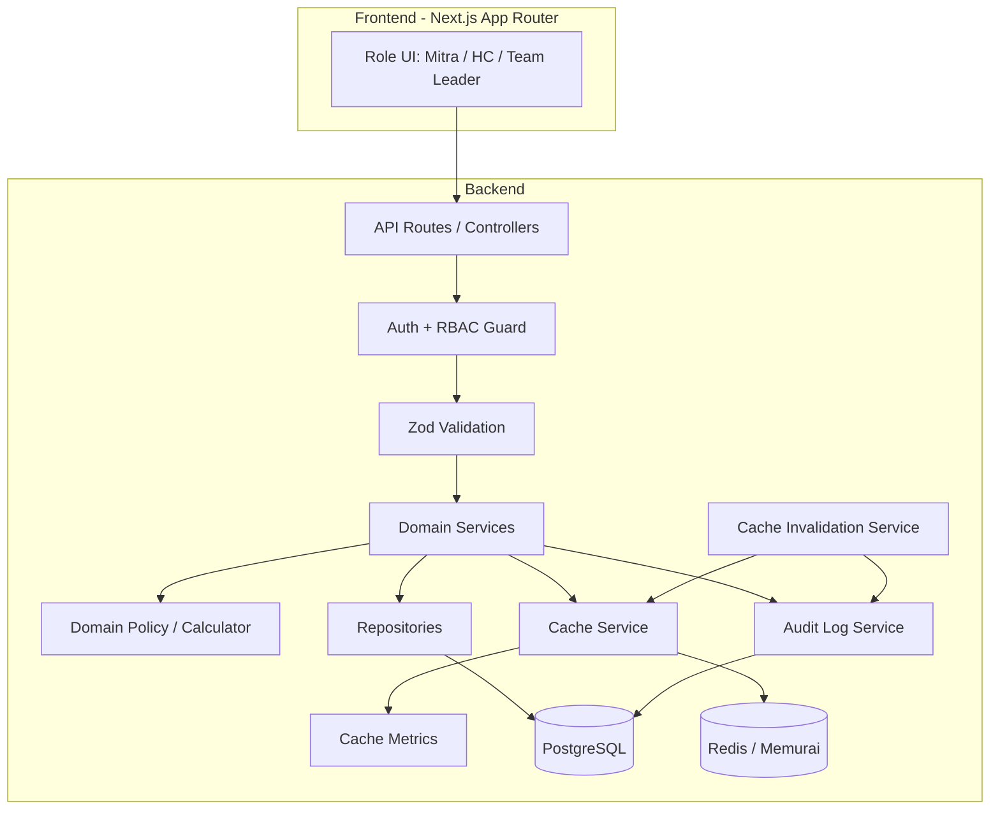
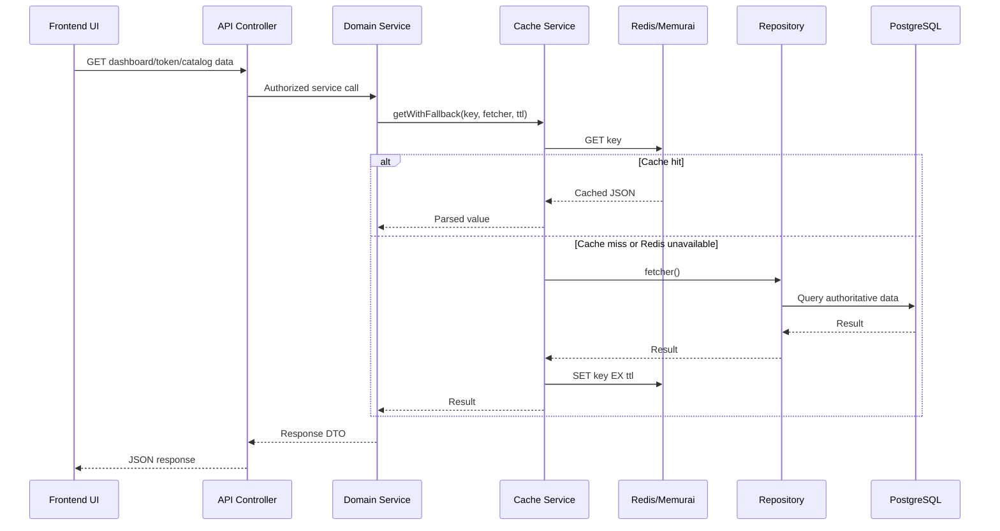
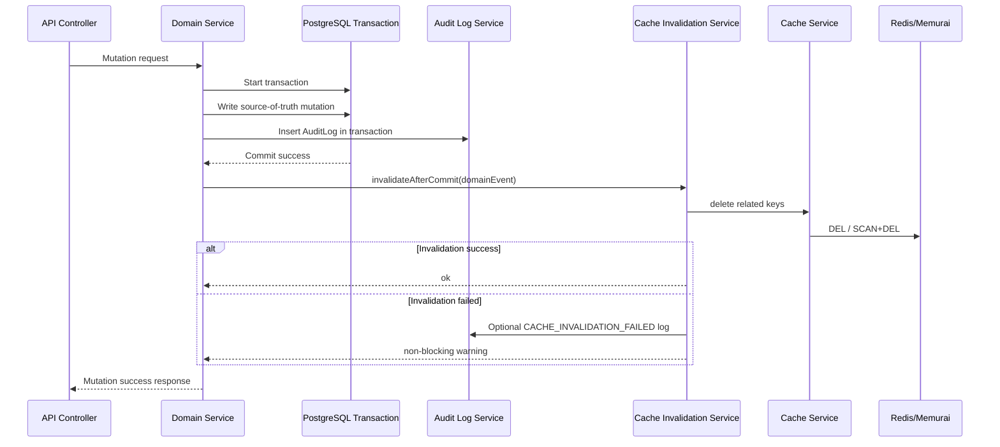

# Design Document: Redis/Memurai Caching Layer

**Product:** Berijalan Employee Loyalty Program Portal  
**Aligned With:** PRD Sprint 2.1 Loyalty Program Stabilization & Requirement Alignment  
**Document Version:** 2.1  
**Date:** May 15, 2026  
**Status:** Implementation Ready Draft

---

## 1. Overview

This document describes the technical design for implementing Redis/Memurai caching in the Loyalty Program Portal backend.

The design improves read performance for token balance, token expiry summaries, membership tier/progress, reward catalog, dashboard summaries, and safe redemption eligibility previews. It preserves Sprint 2.1 correctness by keeping PostgreSQL as the source of truth and by invalidating cache only after successful database commits.

Redis/Memurai must be treated as an optional acceleration layer, not a required dependency for core business correctness.

---

## 2. Design Goals

1. Reduce PostgreSQL read load for frequently requested dashboard and catalog data.
2. Keep token, membership, redemption, reward, and partner-status correctness unchanged.
3. Avoid stale reads after critical mutations through deterministic invalidation.
4. Support Redis in production and Memurai for local Windows development.
5. Continue operating in database-only mode when Redis/Memurai fails.
6. Emit safe cache metrics for operational monitoring.
7. Follow Sprint 2.1 backend layering:
   `Route/Controller → Auth + Validation → Service → Domain Policy → Repository → PostgreSQL`.

---

## 3. Non-Goals

1. Do not store canonical token ledger rows in Redis.
2. Do not use Redis as a queue or job scheduler in Sprint 2.1.
3. Do not cache sensitive identity documents or secrets.
4. Do not implement role authorization inside cache helpers.
5. Do not use cached values for final redemption approval.
6. Do not hardcode unconfirmed Techno downgrade/reset penalty.

---

## 4. Target Architecture



---

## 5. Runtime Flow

### 5.1 Read-Through Cache Flow



### 5.2 Mutation + Post-Commit Invalidation Flow



---

## 6. Backend Module Structure

```txt
Backend/src/
  utils/
    cache/
      cache.config.ts
      redis-client.ts
      cache.service.ts
      cache-metrics.ts
      cache-key.registry.ts
      cache-invalidation.service.ts
      cache-errors.ts
      index.ts
  services/
    token-ledger.service.ts
    token-expiry.service.ts
    membership.service.ts
    reward-catalog.service.ts
    redemption.service.ts
    partner-status.service.ts
    audit-log.service.ts
  repositories/
    token-ledger.repository.ts
    membership.repository.ts
    reward.repository.ts
    redemption.repository.ts
    user.repository.ts
```

---

## 7. Components and Interfaces

### 7.1 Cache Configuration

```typescript
export const cacheConfigSchema = z.object({
  REDIS_ENABLED: z.coerce.boolean().default(true),
  REDIS_HOST: z.string().max(255).default('127.0.0.1'),
  REDIS_PORT: z.coerce.number().int().min(1).max(65535).default(6379),
  REDIS_PASSWORD: z.string().max(512).optional(),
  REDIS_USE_TLS: z.coerce.boolean().default(false),
  REDIS_CONNECTION_TIMEOUT: z.coerce.number().int().positive().default(5000),
  REDIS_MAX_RETRIES: z.coerce.number().int().min(0).max(10).default(3),
  REDIS_KEY_PREFIX: z.string().min(1).max(64).default('loyalty:dev'),
  REDIS_DEFAULT_TTL: z.coerce.number().int().min(1).max(31536000).default(300),
});
```

### 7.2 Redis Client

```typescript
export interface RedisClientConfig {
  enabled: boolean;
  host: string;
  port: number;
  password?: string;
  useTLS: boolean;
  connectionTimeoutMs: number;
  maxRetries: number;
  keyPrefix: string;
}

export interface IRedisClient {
  connect(): Promise<void>;
  disconnect(): Promise<void>;
  isConnected(): boolean;
  isEnabled(): boolean;
  getClient(): Redis | null;
}
```

**Design Notes:**

- Use one shared Redis client singleton for the backend process.
- Return `null` client when `REDIS_ENABLED=false` or connection fails.
- Use bounded retry and exponential backoff.
- Log startup failure and continue in database-only mode.

---

### 7.3 Cache Service

```typescript
export interface ICacheService {
  get<T>(key: CacheKey): Promise<T | null>;
  set<T>(key: CacheKey, value: T, ttlSeconds?: number): Promise<void>;
  delete(key: CacheKey): Promise<void>;
  exists(key: CacheKey): Promise<boolean>;
  deleteBatch(keys: CacheKey[]): Promise<void>;
  deleteByPattern(pattern: CacheKeyPattern): Promise<number>;
  getWithFallback<T>(
    key: CacheKey,
    fetcher: () => Promise<T>,
    ttlSeconds?: number
  ): Promise<T>;
}
```

**Behavior:**

- `get` returns `null` on cache miss or safe cache failure.
- `set` failure is logged and non-blocking.
- `delete` failure is logged and non-blocking.
- `getWithFallback` always returns database data when cache is unavailable.
- JSON serialization failure returns `CACHE006`.
- Invalid key pattern returns `CACHE004`.

---

### 7.4 Cache Key Registry

```typescript
export const CacheTTL = {
  TOKEN_BALANCE: 300,
  TOKEN_EXPIRY_SUMMARY: 300,
  MEMBERSHIP_TIER: 600,
  MEMBERSHIP_PROGRESS: 600,
  REWARD_CATALOG_ACTIVE: 3600,
  REWARD_CATALOG_ADMIN: 600,
  REDEMPTION_ELIGIBILITY: 120,
  TEAM_TOKEN_SUMMARY: 300,
  MITRA_DASHBOARD: 120,
} as const;

export const CacheKeys = {
  tokenBalance: (userId: string) => `token:balance:${userId}`,
  tokenExpirySummary: (userId: string) => `token:expiry-summary:${userId}`,
  membershipTier: (userId: string) => `membership:tier:${userId}`,
  membershipProgress: (userId: string) => `membership:progress:${userId}`,
  rewardCatalogActive: () => `reward:catalog:active`,
  rewardCatalogAdmin: () => `reward:catalog:admin`,
  redemptionEligibility: (userId: string) => `redemption:eligibility:${userId}`,
  teamTokenSummary: (teamLeadId: string) => `team:token-summary:${teamLeadId}`,
  mitraDashboard: (userId: string) => `dashboard:mitra:${userId}`,
} as const;
```

---

### 7.5 Cache Invalidation Service

```typescript
export type CacheInvalidationEvent =
  | { type: 'TOKEN_MUTATED'; userId: string; teamLeadId?: string }
  | { type: 'MEMBERSHIP_MUTATED'; userId: string; tokenPenaltyApplied?: boolean }
  | { type: 'REWARD_CATALOG_MUTATED' }
  | { type: 'REWARD_STOCK_MUTATED'; userIdsToInvalidate?: string[] }
  | { type: 'PARTNER_STATUS_MUTATED'; userId: string; teamLeadId?: string }
  | { type: 'REDEMPTION_MUTATED'; userId: string }
  | { type: 'MONTHLY_MEMBERSHIP_EVALUATION'; affectedUserIds: string[] };

export interface ICacheInvalidationService {
  invalidateAfterCommit(event: CacheInvalidationEvent): Promise<void>;
}
```

**Invalidation Rules:**

| Event | Keys to Delete |
|---|---|
| `TOKEN_MUTATED` | `token:balance:{userId}`, `token:expiry-summary:{userId}`, `membership:progress:{userId}`, `redemption:eligibility:{userId}`, `dashboard:mitra:{userId}`, optional `team:token-summary:{teamLeadId}` |
| `MEMBERSHIP_MUTATED` | `membership:tier:{userId}`, `membership:progress:{userId}`, `redemption:eligibility:{userId}`, `dashboard:mitra:{userId}`, and token keys if penalty/reset applied |
| `REWARD_CATALOG_MUTATED` | `reward:catalog:active`, `reward:catalog:admin`, `redemption:eligibility:*` |
| `REWARD_STOCK_MUTATED` | `reward:catalog:active`, `reward:catalog:admin`, affected `redemption:eligibility:{userId}` when known |
| `PARTNER_STATUS_MUTATED` | `redemption:eligibility:{userId}`, `dashboard:mitra:{userId}`, `membership:tier:{userId}`, optional team summary |
| `REDEMPTION_MUTATED` | `dashboard:mitra:{userId}`, `redemption:eligibility:{userId}` |
| `MONTHLY_MEMBERSHIP_EVALUATION` | Membership, token, dashboard, and eligibility keys for affected users |

---

## 8. Domain Integration Design

### 8.1 Token Ledger Service

```typescript
async function getTokenBalance(userId: string): Promise<number> {
  return cacheService.getWithFallback(
    CacheKeys.tokenBalance(userId),
    () => tokenLedgerRepository.sumBalanceByUserId(userId),
    CacheTTL.TOKEN_BALANCE
  );
}
```

**Mutation Rule:**

```typescript
async function creditTokens(command: CreditTokenCommand): Promise<void> {
  await db.transaction(async (tx) => {
    await tokenLedgerRepository.insertCredit(tx, command);
    await auditLogService.record(tx, 'TOKEN_CREDITED', command);
  });

  await cacheInvalidation.invalidateAfterCommit({
    type: 'TOKEN_MUTATED',
    userId: command.userId,
    teamLeadId: command.teamLeadId,
  });
}
```

**Important:** Token balance for approval/debit checks must be queried in transaction from PostgreSQL, not from cache.

---

### 8.2 Redemption Service

```typescript
async function approveRedemption(command: ApproveRedemptionCommand): Promise<void> {
  await db.transaction(async (tx) => {
    const redemption = await redemptionRepository.lockById(tx, command.redemptionId);
    const reward = await rewardRepository.lockById(tx, redemption.rewardItemId);
    const balance = await tokenLedgerRepository.sumBalanceByUserIdForUpdate(tx, redemption.mitraId);

    redemptionPolicy.assertCanApprove({ redemption, reward, balance });

    await tokenLedgerRepository.insertDebit(tx, {
      userId: redemption.mitraId,
      amount: -redemption.tokenCost,
      eventType: 'REDEEMED',
      referenceId: redemption.id,
      performedBy: command.actorId,
    });

    await redemptionRepository.markApproved(tx, redemption.id);
    await auditLogService.record(tx, 'REDEMPTION_APPROVED', command);
  });

  await cacheInvalidation.invalidateAfterCommit({
    type: 'TOKEN_MUTATED',
    userId: redemption.mitraId,
  });

  await cacheInvalidation.invalidateAfterCommit({
    type: 'REWARD_STOCK_MUTATED',
    userIdsToInvalidate: [redemption.mitraId],
  });
}
```

**Important:** Cached eligibility is UX-only. Submission and approval must revalidate partner status, token balance, reward active status, stock, and redemption window against PostgreSQL.

---

### 8.3 Membership Service

Membership cache is used only for read display. Evaluation jobs and membership mutations use authoritative database queries and domain calculators.

```typescript
async function getMembershipSummary(userId: string): Promise<MembershipSummaryDto> {
  return cacheService.getWithFallback(
    CacheKeys.membershipTier(userId),
    () => membershipRepository.getMembershipSummary(userId),
    CacheTTL.MEMBERSHIP_TIER
  );
}
```

After upgrade, downgrade, reset, manual correction, division change, or scheduled evaluation:

```typescript
await cacheInvalidation.invalidateAfterCommit({
  type: 'MEMBERSHIP_MUTATED',
  userId,
  tokenPenaltyApplied: eventType === 'DOWNGRADE_PENALTY' || eventType === 'RESET_PENALTY',
});
```

---

### 8.4 Reward Catalog Service

```typescript
async function getActiveRewardCatalog(): Promise<RewardItemDto[]> {
  return cacheService.getWithFallback(
    CacheKeys.rewardCatalogActive(),
    () => rewardRepository.findActiveRewards(),
    CacheTTL.REWARD_CATALOG_ACTIVE
  );
}
```

After create, update, deactivate, restock, or stock deduction:

```typescript
await cacheInvalidation.invalidateAfterCommit({
  type: 'REWARD_CATALOG_MUTATED',
});
```

---

## 9. Error Handling

| Scenario | Handling | User Impact |
|---|---|---|
| Redis disabled | Use database-only mode | Normal response |
| Redis connection timeout | Log `CACHE002`, fallback to DB | Normal response, possibly slower |
| Redis operation failure | Log `CACHE003`, fallback to DB | Normal response |
| Serialization failure | Log `CACHE006`, skip caching | Normal response |
| Invalidation failure | Log `CACHE007`, continue committed mutation | Normal response |
| Invalid key | Log `CACHE004`, skip operation | Normal response unless developer misuse is tested |

### Fallback Helper

```typescript
async function getWithFallback<T>(
  key: CacheKey,
  fetcher: () => Promise<T>,
  ttlSeconds: number
): Promise<T> {
  const startedAt = performance.now();

  try {
    const cached = await cacheService.get<T>(key);
    if (cached !== null) {
      cacheMetrics.recordHit(performance.now() - startedAt);
      return cached;
    }

    cacheMetrics.recordMiss(performance.now() - startedAt);
  } catch (error) {
    cacheMetrics.recordError();
    logger.warn('Cache read failed; falling back to database', {
      keyPrefix: getSafeKeyPrefix(key),
      code: 'CACHE003',
    });
  }

  const data = await fetcher();

  try {
    await cacheService.set(key, data, ttlSeconds);
  } catch (error) {
    cacheMetrics.recordError();
    logger.warn('Cache write failed; continuing without cache', {
      keyPrefix: getSafeKeyPrefix(key),
      code: 'CACHE003',
    });
  }

  return data;
}
```

---

## 10. Metrics Design

```typescript
export interface CacheMetrics {
  cache_hit_rate: number;
  cache_miss_rate: number;
  average_response_time_ms: number;
  error_count: number;
  window_start: string;
  service_name: 'cache';
}
```

Metrics are calculated in a 1-minute rolling window and emitted as structured JSON logs. They must not include raw user IDs, emails, KTP numbers, NPWP numbers, or full cache keys where sensitive identifiers may appear.

---

## 11. Security and Privacy

1. Cache reads happen only after server-side authorization.
2. Cache keys may contain internal UUIDs but must never contain email, KTP, NPWP, or names.
3. Cache logs must use safe key prefix, not full key.
4. Cache must not store password reset tokens or authentication secrets in this implementation.
5. Redis production connection must support TLS and password authentication.
6. Redis is not a substitute for RBAC, validation, policy checks, or database constraints.

---

## 12. Testing Strategy

### 12.1 Unit Tests

Files:

```txt
Backend/src/utils/cache/cache.service.test.ts
Backend/src/utils/cache/cache-key.registry.test.ts
Backend/src/utils/cache/cache-invalidation.service.test.ts
Backend/src/utils/cache/cache.config.test.ts
```

Coverage:

- Config validation.
- Key generation.
- TTL validation.
- JSON serialization/deserialization.
- Safe failure behavior.
- Invalidation event-to-key mapping.
- Batch delete max 100 keys.
- `deleteByPattern` uses scan-based deletion.

### 12.2 Integration Tests

Files:

```txt
Backend/src/utils/cache/cache.integration.test.ts
Backend/src/services/token-ledger.cache.integration.test.ts
Backend/src/services/reward-catalog.cache.integration.test.ts
Backend/src/services/membership.cache.integration.test.ts
```

Coverage:

- Redis-compatible set/get/delete.
- TTL expiration.
- Token balance cache miss → DB → cache.
- Token mutation → post-commit invalidation.
- Reward update → catalog invalidation.
- Membership update → membership cache invalidation.
- Redis unavailable → database fallback.

### 12.3 Service Flow Tests

Coverage:

- Redemption approval does not use cached balance for final debit.
- Concurrent redemption approval cannot double debit.
- Expiry job does not rely on cache.
- Monthly membership evaluation invalidates affected users.
- Techno penalty remains blocked behind `TODO(OQ-TECHNO-PENALTY)`.

---

## 13. `.env.example`

```env
# Redis / Memurai Cache
REDIS_ENABLED=true
REDIS_HOST=127.0.0.1
REDIS_PORT=6379
REDIS_PASSWORD=
REDIS_USE_TLS=false
REDIS_CONNECTION_TIMEOUT=5000
REDIS_MAX_RETRIES=3
REDIS_KEY_PREFIX=loyalty:dev
REDIS_DEFAULT_TTL=300
```

Production example:

```env
REDIS_ENABLED=true
REDIS_HOST=your-redis-host
REDIS_PORT=6379
REDIS_PASSWORD=change-me
REDIS_USE_TLS=true
REDIS_CONNECTION_TIMEOUT=5000
REDIS_MAX_RETRIES=3
REDIS_KEY_PREFIX=loyalty:prod
REDIS_DEFAULT_TTL=300
```

---

## 14. Implementation Checklist

- [ ] Add cache config schema.
- [ ] Add Redis client singleton.
- [ ] Add cache service with graceful fallback.
- [ ] Add cache key registry.
- [ ] Add cache metrics.
- [ ] Add cache invalidation service.
- [ ] Integrate token balance read cache.
- [ ] Integrate token expiry summary read cache.
- [ ] Integrate membership tier/progress read cache.
- [ ] Integrate reward catalog read cache.
- [ ] Add safe redemption eligibility preview cache.
- [ ] Add invalidation after token mutations.
- [ ] Add invalidation after redemption approval/rejection/status updates.
- [ ] Add invalidation after reward catalog mutations.
- [ ] Add invalidation after partner status mutations.
- [ ] Add invalidation after membership evaluation.
- [ ] Update `.env.example`.
- [ ] Add unit tests.
- [ ] Add integration tests.
- [ ] Add smoke tests.
- [ ] Run `pnpm lint`, `pnpm typecheck`, `pnpm test:unit`, `pnpm test:integration`.

---

## 15. Definition of Done

The Redis/Memurai caching layer is accepted when:

1. Redis can be enabled or disabled by environment config.
2. Application still works when Redis/Memurai is unavailable.
3. Token balance is cached for reads but recomputed/locked from PostgreSQL for mutations.
4. Reward catalog cache is invalidated after all reward and stock mutations.
5. Membership cache is invalidated after all tier/progress-affecting changes.
6. Expiry job and membership evaluation job are idempotent and do not depend on cache.
7. Cache metrics are emitted safely.
8. Sensitive data is not cached or logged.
9. Tests prove cache hit, miss, invalidation, TTL expiry, and fallback behavior.
10. Implementation remains aligned with Sprint 2.1 architecture, audit, validation, and data-integrity rules.
