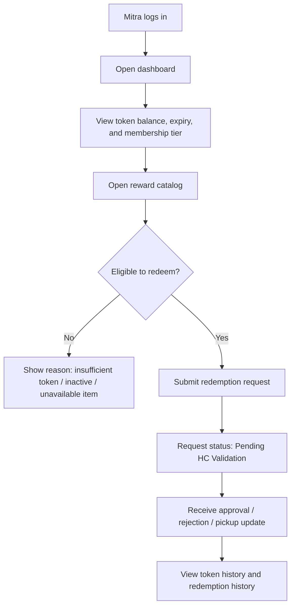
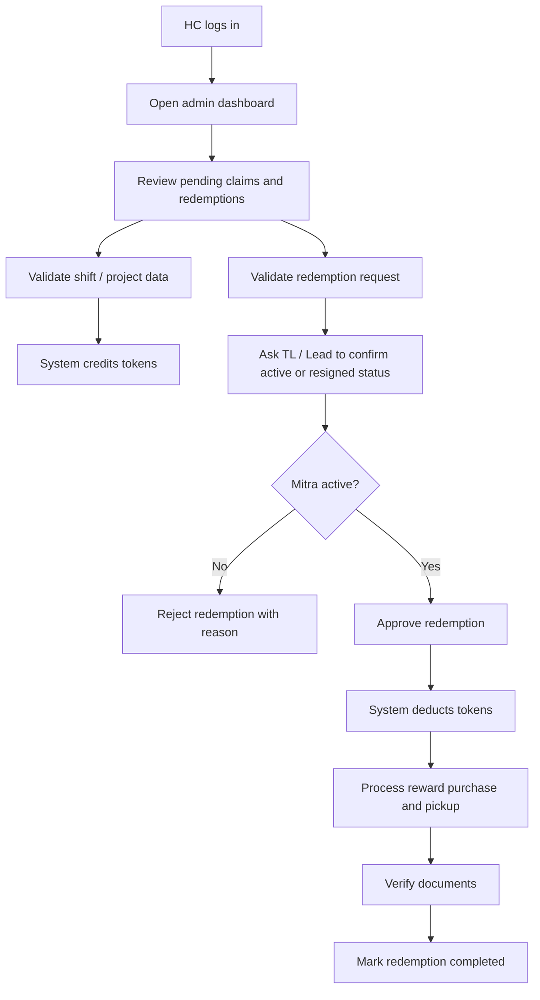
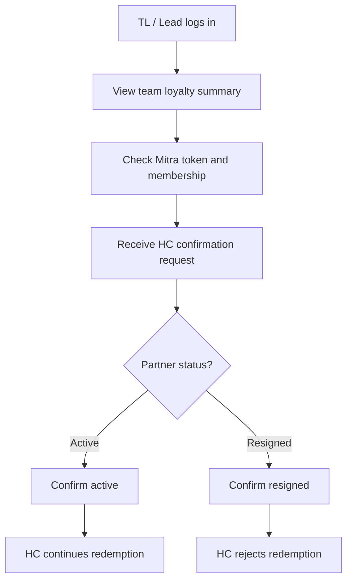
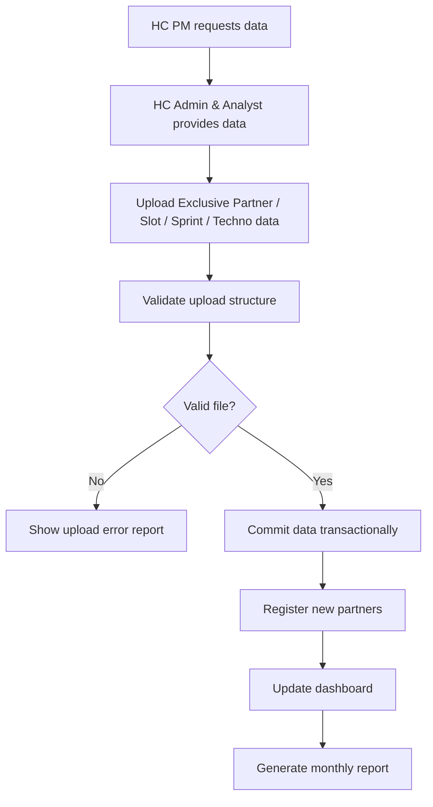
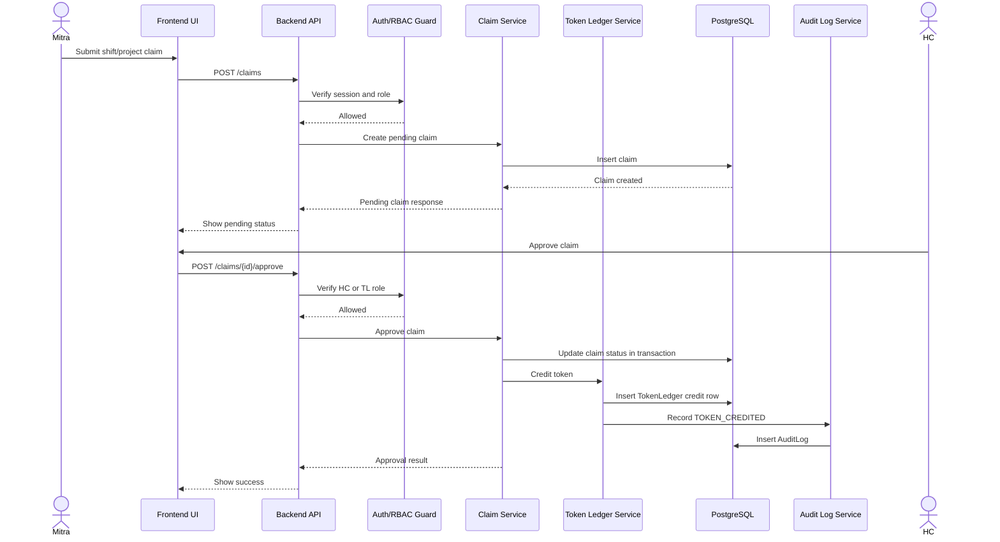
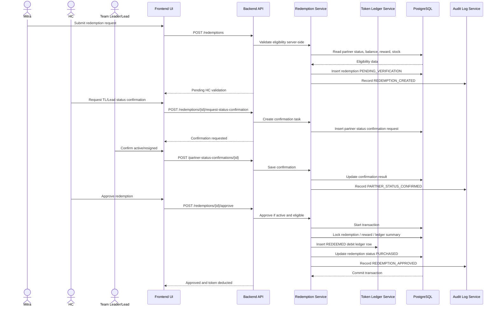
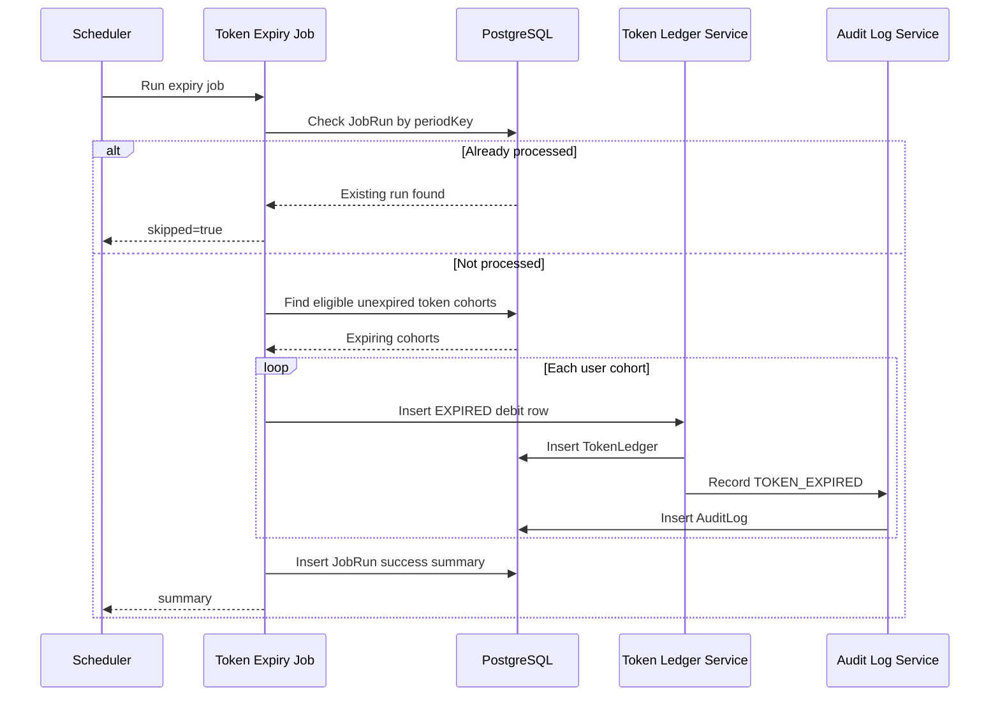
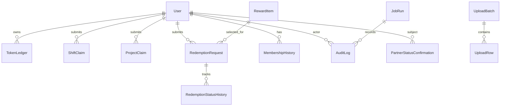

# PRD — Sprint 2.1 Loyalty Program Stabilization & Requirement Alignment

**Product:** Berijalan Employee Loyalty Program Portal  
**Document Version:** 2.1  
**Date:** May 15, 2026  
**Status:** Sprint Execution Draft  
**Primary Goal:** Fix all current backend and frontend issues, then align implementation with the latest `Dokumen Kebutuhan Sistem - Loyalty Program.docx`.

---

## 1. Overview

### 1.1 Product Context

The Loyalty Program Portal is an internal platform used to reward partners / employees (`Mitra`) for additional work contribution, especially extra shifts, slots, sprints, and projects. Contributions are converted into tokens. Tokens are accumulated in the Mitra account and can be redeemed for rewards through Human Capital (`HC`) validation and Team Leader / Lead confirmation.

### 1.2 Sprint 2.1 Purpose

Sprint 2.1 is a stabilization and requirement-alignment sprint. The sprint does not introduce large experimental scope. The priority is to make the backend and frontend reliable, consistent, secure, auditable, and aligned with the latest system requirement document.

### 1.3 Primary Sprint Outcomes

By the end of Sprint 2.1:

1. All known backend API, validation, database, and role-access issues are fixed.
2. All known frontend UI, routing, loading, error, empty-state, and responsiveness issues are fixed.
3. The implemented product flow matches the latest requirement document:
   - Mitra takes shift / project.
   - Shift / sprint / project data is validated.
   - Tokens are credited to Mitra.
   - Mitra views accumulated tokens and reward catalog.
   - Mitra submits redemption.
   - HC validates redemption.
   - HC confirms active / resigned status with Team Leader / Lead.
   - Reward is processed.
   - Tokens are deducted after approved redemption.
   - Expired tokens are automatically handled.
4. Role-based access is enforced on the server, not only in UI navigation.
5. Critical token, redemption, membership, and admin actions are audit-logged.
6. The codebase is ready for continued Sprint 2.x feature development without unstable foundations.

### 1.4 Out of Scope

The following are not required for Sprint 2.1 unless already partially implemented and blocking current stability:

- Full AI reward recommendation engine.
- Full SSO production integration.
- WhatsApp automation integration.
- Advanced analytics dashboard.

---

## 2. Requirements

### 2.1 Sprint Requirement Summary

| ID | Requirement | Priority | Acceptance Criteria |
|---|---|---:|---|
| SPR21-REQ-01 | Fix backend issue backlog | Must | All failing API flows are reproducible, fixed, and covered by tests where critical. |
| SPR21-REQ-02 | Fix frontend issue backlog | Must | Pages render without runtime errors, have loading / empty / error states, and follow design tokens. |
| SPR21-REQ-03 | Align role model with latest document | Must | `MITRA`, `HC`, and `TEAM_LEADER` permissions are enforced in middleware / server services. |
| SPR21-REQ-04 | Implement / verify token lifecycle | Must | Token credit, accumulation, redemption debit, manual adjustment, and expiry use append-only ledger entries. |
| SPR21-REQ-05 | Implement / verify reward redemption flow | Must | Mitra can request redemption; HC validates; TL/Lead confirms active/resign status; approved redemption deducts tokens. |
| SPR21-REQ-06 | Implement / verify membership visibility | Must | Mitra sees current membership tier: Saphire, Emerald, Ruby, or Diamond. |
| SPR21-REQ-07 | Add expiry visibility and reminder foundation | Must | Token expiry data is stored by earned year and visible to Mitra; reminder service is stubbed or implemented safely. |
| SPR21-REQ-08 | Add audit log for admin mutations | Must | Token, reward, redemption, membership, partner status, and manual adjustment changes create audit entries. |
| SPR21-REQ-09 | Fix validation gaps | Must | All mutation payloads use Zod validation or equivalent strict schema validation. |
| SPR21-REQ-10 | Improve automated testing | Must | Unit tests cover token and membership logic; integration tests cover service flows; E2E covers critical role journeys. |
| SPR21-REQ-11 | Apply the confirmed Techno policy | Must | Techno downgrade penalty is 50% of the current balance, rounded down. |
| SPR21-REQ-12 | Update project guidance | Must | `AGENTS.md` reflects Sprint 2.1 rules, token-saving commands, and current architecture. |

### 2.2 Functional Requirements

#### Authentication & Authorization

| ID | Requirement | Priority |
|---|---|---:|
| AUTH-01 | Users can log in using registered NPK and password. | Must |
| AUTH-02 | System redirects users to the correct role shell after login. | Must |
| AUTH-03 | Password reset flow exists or safe placeholder is documented. | Must |
| AUTH-04 | SSO remains optional and behind future implementation. | Should |
| AUTH-05 | Backend denies unauthorized role access regardless of UI state. | Must |

#### Mitra Requirements

| ID | Requirement | Priority |
|---|---|---:|
| MITRA-01 | View current token balance. | Must |
| MITRA-02 | View token history. | Must |
| MITRA-03 | View reward catalog. | Must |
| MITRA-04 | Submit reward redemption. | Must |
| MITRA-05 | View token expiry date / expiry cohort. | Must |
| MITRA-06 | Receive expiry reminder foundation. | Should |
| MITRA-07 | Receive reminder to take slots and avoid downgrade/reset. | Should |
| MITRA-08 | View membership tier. | Must |
| MITRA-09 | Ask / view loyalty program rules. | Should |
| MITRA-10 | AI reward recommendation. | Future |

#### Human Capital Requirements

| ID | Requirement | Priority |
|---|---|---:|
| HC-01 | Manage token rules. | Must |
| HC-02 | Add / edit / deactivate reward catalog items. | Must |
| HC-03 | Configure or verify token expiry policy. | Must |
| HC-04 | Perform manual token adjustment with mandatory reason. | Must |
| HC-05 | Validate redemption request. | Must |
| HC-06 | Confirm active / resigned status through TL/Lead workflow. | Must |
| HC-07 | Process reward handover status. | Should |
| HC-08 | View audit log. | Must |

#### Team Leader / Lead Requirements

| ID | Requirement | Priority |
|---|---|---:|
| TL-01 | Confirm Mitra partnership status: active / resigned. | Must |
| TL-02 | View Mitra token summary. | Must |
| TL-03 | View Mitra membership tier. | Must |
| TL-04 | Notify Mitra about token total, eligible redemption, and expiry details. | Should |

### 2.3 Non-Functional Requirements

| Category | Requirement |
|---|---|
| Security | Enforce server-side authorization, deny by default, never trust client role state. |
| Auditability | Every token, redemption, membership, reward, and partner-status mutation must be auditable. |
| Data Integrity | Token ledger is append-only. Balance is derived from ledger sum. |
| Reliability | Scheduled jobs are idempotent and use run-log guards. |
| Maintainability | Business rules live in domain/service modules, not UI components. |
| UX | Every async page has loading, empty, and error state. |
| Accessibility | Components meet WCAG 2.1 AA minimum. |
| Performance | Prefer server-side data fetching for sensitive data and reduce unnecessary client JavaScript. |
| Testing | Critical policy flows have automated tests. |

---

## 3. Core Features

### 3.1 Sprint 2.1 Core Feature Scope

#### Feature 1 — Backend Stabilization

**Goal:** Fix API, service, repository, validation, auth, database, and scheduled-job issues.

**Required Work:**

- Normalize backend architecture:
  - Controller / route handler
  - Auth + validation middleware
  - Service
  - Repository
  - Database
- Remove Prisma or database calls from route handlers.
- Add Zod schema validation to all mutations.
- Add typed domain errors.
- Ensure all admin mutations write audit logs.
- Ensure token ledger is append-only.
- Ensure redemption eligibility is checked on the server.

**Acceptance Criteria:**

- No route handler contains business policy calculation.
- Token balance is never trusted from client input.
- Unauthorized role access returns `403`.
- Invalid payload returns `400` with safe validation message.
- Critical backend flows have unit or integration tests.

#### Feature 2 — Frontend Stabilization

**Goal:** Fix UI errors and align pages with the design system.

**Required Work:**

- Add `loading.tsx` for data-fetching routes.
- Use skeleton loading, not spinner-only UI.
- Add empty and error states.
- Use design tokens from `DESIGN.md`.
- Light mode is the default; dark mode is supported through shared design tokens.
- Keep dashboard bento grid and token-driven surface styling.
- Ensure responsive layouts for 375px, 768px, and 1280px.

**Acceptance Criteria:**

- No page crashes on missing data.
- No hardcoded random colors outside design tokens.
- Token numbers are visually prominent.
- Role navigation is consistent for Mitra, HC, and Team Leader.
- Keyboard focus state is visible.

#### Feature 3 — Token Lifecycle Alignment

**Goal:** Make token behavior match the system requirement.

**Required Rules:**

- Tokens are credited after shift / sprint / project validation.
- Tokens are accumulated per Mitra.
- Token balance is calculated from ledger entries.
- Token is deducted only after valid redemption approval.
- Expired token is deducted using an `EXPIRED` ledger event.
- Manual adjustment requires reason and audit log.

**Acceptance Criteria:**

- Ledger rows are inserted, never updated or deleted.
- Redemption debit cannot happen twice for the same approved request.
- Expiry job is idempotent.
- Manual adjustment records actor, reason, previous state, and new state.

#### Feature 4 — Redemption Workflow Alignment

**Goal:** Align redemption with latest workflow.

**Workflow:**

1. Mitra opens reward catalog.
2. System shows token cost and eligibility status.
3. Mitra submits redemption request.
4. Backend checks:
   - Active partner status.
   - Sufficient token balance.
   - Reward is active.
   - Stock is available if stock is limited.
   - Redemption is inside allowed period.
5. HC validates request.
6. HC asks Team Leader / Lead to confirm active / resigned status.
7. If Mitra is active, HC approves redemption.
8. System deducts token using ledger debit.
9. HC processes item purchase / pickup.
10. HC verifies required documents before completion.

**Acceptance Criteria:**

- Ineligible Mitra receives clear rejection reason.
- Resigned Mitra cannot complete redemption.
- Token deduction is atomic with redemption approval.
- Document verification is required before `COMPLETED` status.

#### Feature 5 — Membership & Division Rule Alignment

**Goal:** Ensure membership rules are implemented consistently and safely.

**Opcent / Tele Rules:**

| Tier | Slot Threshold | Health Benefit |
|---|---:|---|
| Saphire | 0 | None |
| Emerald | 430 | FIT |
| Ruby | 860 | FIT |
| Diamond | 1300 | CLASSY |

- 1 slot = 1 token.
- Evaluation deadline: December 15.
- Downgrade trigger: no slot accumulation for 3 consecutive months.
- Downgrade penalty: 50% token cut.
- Reset trigger: unavailable / no slot for 3 consecutive months.
- Reset effect: tier becomes Saphire and token balance becomes 0.

**Techno Rules:**

| Tier | Project Threshold per 6 Months | Health Benefit |
|---|---:|---|
| Saphire | 0 | None |
| Emerald | 25 | FIT |
| Ruby | 50 | FIT |
| Diamond | 75 | CLASSY |

- Techno evaluation period: 6 months.
- Downgrade / reset trigger: 3 or more project rejections in a 6-month period.
- Techno downgrade penalty is 50% of the current balance, rounded down.

**Acceptance Criteria:**

- Opcent / Tele and Techno calculators are separate modules behind a shared interface.
- The Techno penalty baseline is fixed for Sprint 2.1; no runtime feature flag is required.
- Membership change inserts membership history and audit log.

#### Feature 6 — Monthly Update Workflow Foundation

**Goal:** Support monthly operational maintenance.

**Required Work:**

- Provide upload / import foundation for:
  - Exclusive Partner Data.
  - Slot Data.
  - Sprint Data.
  - Project Rejection Data.
  - Techno Employee Database.
- Register new partners from latest active partner data.
- Update dashboard data after monthly data acquisition.
- Prepare report export foundation for HC Monthly Report.

**Acceptance Criteria:**

- Upload validation checks MIME type and parsed file header.
- Invalid upload does not partially mutate production data.
- Upload commit is transactional and audit-logged.
- Upload processing result shows success, warning, and error rows.

---

## 4. User Flow

### 4.1 Mitra Flow



### 4.2 Human Capital Flow



### 4.3 Team Leader / Lead Flow



### 4.4 Monthly Update Flow



---

## 5. Architecture

### 5.1 Target Architecture

```txt
Frontend: Next.js App Router
  ├─ Public routes: login, reset password
  ├─ Mitra routes: dashboard, tokens, rewards, redemptions
  ├─ HC routes: uploads, processing, redemptions, catalog, members, audit
  └─ Team Lead routes: team, members, confirmation queue

Backend/API
  ├─ Controllers / route handlers
  ├─ Auth + role middleware
  ├─ Zod validation schemas
  ├─ Services
  ├─ Domain policy modules
  ├─ Repositories
  ├─ Scheduled jobs
  └─ Audit logger

Database: PostgreSQL
  ├─ Users and roles
  ├─ Token ledger
  ├─ Claims
  ├─ Rewards
  ├─ Redemption requests
  ├─ Membership history
  ├─ Audit logs
  └─ Job run logs
```

### 5.2 Layering Rule

```txt
Request
→ Route / Controller
→ Auth + Validation Middleware
→ Service
→ Domain Policy / Calculator
→ Repository
→ PostgreSQL
```

### 5.3 Frontend Route Structure

```txt
Frontend/src/app/
  (public)/
    login/
    reset-password/
  (mitra)/
    dashboard/
    tokens/
    rewards/
    redemptions/
  (admin)/
    dashboard/
    uploads/
    processing/
    redemptions/
    catalog/
    members/
    audit/
  (teamlead)/
    dashboard/
    team/
    confirmations/
```

### 5.4 Backend Module Structure

```txt
Backend/src/
  api/
    auth/
    tokens/
    claims/
    redemptions/
    rewards/
    uploads/
    memberships/
  controllers/
  services/
    token-ledger.service.ts
    redemption.service.ts
    reward-catalog.service.ts
    membership.service.ts
    upload-processing.service.ts
    partner-status.service.ts
    audit-log.service.ts
  repositories/
  domain/
    token-engine/
      shared/
      opcent-tele/
      techno/
    membership/
    redemption/
  jobs/
    token-expiry.job.ts
    membership-evaluation.job.ts
    reminder-notification.job.ts
  types/
  validations/
```

### 5.5 Security Architecture

- Authentication through Auth.js / NextAuth or compatible provider.
- Server-side RBAC in middleware and service guards.
- Deny-by-default for protected resources.
- No sensitive token / user / reward mutation only on client.
- All privileged mutations require actor ID and audit log.
- Uploaded files are validated by MIME type and parsed header.
- API responses must not expose internal stack traces or hidden admin fields.

### 5.6 Audit Architecture

Audit logs are required for:

- Token credited.
- Token debited.
- Token expired.
- Manual token adjustment.
- Tier upgraded.
- Tier downgraded.
- Tier reset.
- Redemption status changed.
- Upload committed.
- Partner status changed.
- Reward item created / edited / deactivated.

---

## 6. Sequence Diagram

### 6.1 Token Credit After Claim Validation



### 6.2 Redemption Approval With TL/Lead Confirmation



### 6.3 Token Expiry Scheduled Job



---

## 7. Database Schema

> This schema is implementation-oriented and can be mapped to Prisma models. Field names may be adapted to the existing codebase, but the entities and audit requirements must remain intact.

### 7.1 Entity Relationship Overview



### 7.2 Tables

#### users

| Field | Type | Required | Notes |
|---|---|---:|---|
| id | UUID | Yes | Primary key |
| email | varchar | Yes | Unique login identifier |
| name | varchar | Yes | User display name |
| division | enum | Yes | `OPCENT`, `TELE`, `TECHNO` |
| role | enum | Yes | `MITRA`, `HC`, `TEAM_LEADER` |
| partner_status | enum | Yes | `ACTIVE`, `INACTIVE`, `RESIGNED` |
| membership_tier | enum | Yes | `SAPHIRE`, `EMERALD`, `RUBY`, `DIAMOND` |
| health_benefit | enum | Yes | `NONE`, `FIT`, `CLASSY` |
| team_lead_id | UUID | No | FK to users.id |
| joined_at | timestamp | No | Partner join date |
| created_at | timestamp | Yes | Audit field |
| updated_at | timestamp | Yes | Audit field |

#### token_ledger

| Field | Type | Required | Notes |
|---|---|---:|---|
| id | UUID | Yes | Primary key |
| user_id | UUID | Yes | FK users.id |
| event_type | enum | Yes | `EARNED_SHIFT`, `EARNED_PROJECT`, `REDEEMED`, `EXPIRED`, `MANUAL_ADJUSTMENT`, `DOWNGRADE_PENALTY`, `RESET_PENALTY` |
| amount | integer | Yes | Positive credit, negative debit |
| balance_after | integer | Yes | Snapshot for audit display |
| reference_type | varchar | No | claim, redemption, job, adjustment |
| reference_id | UUID | No | Related entity |
| earned_year | integer | No | Required for earned token credits |
| expires_at | date | No | December 31 of earned year + 3 |
| reason | text | No | Required for adjustment and penalty |
| performed_by | UUID | Yes | Actor user ID or system user |
| created_at | timestamp | Yes | Append-only timestamp |

**Constraint:** No update or delete application path is allowed for this table.

#### shift_claims

| Field | Type | Required | Notes |
|---|---|---:|---|
| id | UUID | Yes | Primary key |
| mitra_id | UUID | Yes | FK users.id |
| slot_count | integer | Yes | Must be > 0 |
| shift_date | date | Yes | Contribution date |
| status | enum | Yes | `PENDING`, `APPROVED`, `REJECTED` |
| validated_by | UUID | No | FK users.id |
| validated_at | timestamp | No | Approval / rejection time |
| rejection_reason | text | No | Required when rejected |
| created_at | timestamp | Yes | Audit field |
| updated_at | timestamp | Yes | Audit field |

#### project_claims

| Field | Type | Required | Notes |
|---|---|---:|---|
| id | UUID | Yes | Primary key |
| mitra_id | UUID | Yes | FK users.id |
| project_name | varchar | Yes | Project identifier/name |
| completed_at | date | Yes | Completion date |
| status | enum | Yes | `PENDING`, `APPROVED`, `REJECTED` |
| validated_by | UUID | No | FK users.id |
| validated_at | timestamp | No | Approval / rejection time |
| rejection_reason | text | No | Required when rejected |
| created_at | timestamp | Yes | Audit field |
| updated_at | timestamp | Yes | Audit field |

#### reward_items

| Field | Type | Required | Notes |
|---|---|---:|---|
| id | UUID | Yes | Primary key |
| name | varchar | Yes | Reward name |
| description | text | No | Reward details |
| token_cost | integer | Yes | Must be > 0 |
| image_url | text | No | Optional asset URL |
| category | varchar | No | Optional category eligibility |
| is_active | boolean | Yes | Catalog visibility and redemption eligibility |
| stock | integer | No | Null means unlimited |
| created_by | UUID | Yes | HC actor |
| created_at | timestamp | Yes | Audit field |
| updated_at | timestamp | Yes | Audit field |

#### redemption_requests

| Field | Type | Required | Notes |
|---|---|---:|---|
| id | UUID | Yes | Primary key |
| mitra_id | UUID | Yes | FK users.id |
| reward_item_id | UUID | Yes | FK reward_items.id |
| token_cost | integer | Yes | Snapshot at request time |
| status | enum | Yes | Full redemption lifecycle status |
| submitted_at | timestamp | Yes | Request time |
| verified_by | UUID | No | HC actor |
| verified_at | timestamp | No | HC verification time |
| rejection_reason | text | No | Required if rejected |
| pickup_scheduled_at | timestamp | No | Pickup schedule |
| completed_at | timestamp | No | Completion time |
| id_card_verified | boolean | Yes | Default false |
| ktp_verified | boolean | Yes | Default false |
| npwp_verified | boolean | Yes | Default false |
| power_of_attorney_required | boolean | Yes | Default false |
| power_of_attorney_verified | boolean | No | Required if represented pickup |
| created_at | timestamp | Yes | Audit field |
| updated_at | timestamp | Yes | Audit field |

#### redemption_status_history

| Field | Type | Required | Notes |
|---|---|---:|---|
| id | UUID | Yes | Primary key |
| redemption_request_id | UUID | Yes | FK redemption_requests.id |
| previous_status | enum | No | Null for first status |
| new_status | enum | Yes | New status |
| changed_by | UUID | Yes | Actor user ID |
| note | text | No | Optional status note |
| created_at | timestamp | Yes | Audit field |

#### partner_status_confirmations

| Field | Type | Required | Notes |
|---|---|---:|---|
| id | UUID | Yes | Primary key |
| redemption_request_id | UUID | Yes | Related redemption |
| mitra_id | UUID | Yes | Subject partner |
| requested_by | UUID | Yes | HC actor |
| assigned_to | UUID | Yes | TL/Lead actor |
| status | enum | Yes | `PENDING`, `CONFIRMED_ACTIVE`, `CONFIRMED_RESIGNED`, `CANCELLED` |
| note | text | No | Confirmation note |
| confirmed_at | timestamp | No | Confirmation time |
| created_at | timestamp | Yes | Audit field |
| updated_at | timestamp | Yes | Audit field |

#### membership_history

| Field | Type | Required | Notes |
|---|---|---:|---|
| id | UUID | Yes | Primary key |
| user_id | UUID | Yes | FK users.id |
| previous_tier | enum | Yes | Previous membership tier |
| new_tier | enum | Yes | New membership tier |
| change_reason | enum | Yes | `UPGRADE`, `DOWNGRADE`, `RESET`, `MANUAL` |
| token_balance_before | integer | Yes | Audit snapshot |
| token_balance_after | integer | Yes | Audit snapshot |
| triggered_by | UUID | Yes | Actor or system user |
| created_at | timestamp | Yes | Audit field |

#### audit_logs

| Field | Type | Required | Notes |
|---|---|---:|---|
| id | UUID | Yes | Primary key |
| actor_id | UUID | Yes | User or system actor |
| action | varchar | Yes | Stable action key |
| target_user_id | UUID | No | Affected Mitra |
| target_entity_type | varchar | No | Entity name |
| target_entity_id | UUID | No | Entity ID |
| previous_value | jsonb | No | Previous state snapshot |
| new_value | jsonb | No | New state snapshot |
| ip_address | varchar | No | Request IP when available |
| user_agent | text | No | Request user-agent when available |
| created_at | timestamp | Yes | Audit timestamp |

#### upload_batches

| Field | Type | Required | Notes |
|---|---|---:|---|
| id | UUID | Yes | Primary key |
| upload_type | enum | Yes | `EXCLUSIVE_PARTNER`, `SLOT`, `SPRINT`, `PROJECT_REJECTION`, `TECHNO_EMPLOYEE` |
| filename | varchar | Yes | Original filename |
| status | enum | Yes | `UPLOADED`, `VALIDATED`, `FAILED`, `COMMITTED` |
| uploaded_by | UUID | Yes | HC actor |
| row_count | integer | Yes | Parsed rows |
| error_count | integer | Yes | Validation errors |
| committed_at | timestamp | No | Commit time |
| created_at | timestamp | Yes | Audit field |

#### job_runs

| Field | Type | Required | Notes |
|---|---|---:|---|
| id | UUID | Yes | Primary key |
| job_name | varchar | Yes | Scheduled job key |
| period_key | varchar | Yes | Example: `2026-05`, `2026-P1` |
| status | enum | Yes | `RUNNING`, `SUCCESS`, `FAILED`, `SKIPPED` |
| summary | jsonb | No | Evaluation result |
| started_at | timestamp | Yes | Start time |
| finished_at | timestamp | No | End time |

---

## 8. Tech Stack

### 8.1 Required Stack

| Layer | Technology |
|---|---|
| Frontend Framework | Next.js App Router |
| Language | TypeScript strict mode |
| Backend Runtime | Node.js / Next.js server runtime or existing backend service runtime |
| Database | PostgreSQL |
| ORM | Prisma preferred if already used; otherwise keep current ORM consistently |
| Validation | Zod |
| Authentication | Auth.js / NextAuth or current equivalent |
| Styling | Tailwind CSS |
| UI Primitives | shadcn/ui |
| Animation | Framer Motion where needed |
| Forms | React Hook Form + Zod resolver |
| Data Tables | TanStack Table |
| Unit Testing | Vitest |
| E2E Testing | Playwright or Cypress, keep existing project standard |
| Package Manager | pnpm |
| Documentation | Markdown docs in repository root |

### 8.2 TypeScript Compiler Expectations

```jsonc
{
  "strict": true,
  "noUncheckedIndexedAccess": true,
  "exactOptionalPropertyTypes": true,
  "noImplicitReturns": true,
  "noFallthroughCasesInSwitch": true
}
```

### 8.3 Quality Gates

Before Sprint 2.1 can be marked complete:

```bash
pnpm lint
pnpm typecheck
pnpm test:unit
pnpm test:integration
pnpm test:e2e
```

If a command is not available yet, create or document it before closing Sprint 2.1.

---

## 9. Issue Fixing Strategy

### 9.1 Backend Fix Order

1. Reproduce backend issue.
2. Add failing unit / integration test if issue is policy-critical.
3. Fix domain logic first.
4. Fix service orchestration.
5. Fix repository query.
6. Add audit log if mutation is admin/system-driven.
7. Verify transaction safety.
8. Verify authorization guard.
9. Run relevant test suite.

### 9.2 Frontend Fix Order

1. Reproduce UI issue.
2. Identify route and role affected.
3. Verify data contract from backend.
4. Add loading / empty / error state.
5. Fix component using design tokens.
6. Add stable `data-testid` if E2E flow depends on it.
7. Test at mobile, tablet, and desktop widths.
8. Run relevant E2E spec.

### 9.3 Defect Severity

| Severity | Definition | Sprint Handling |
|---|---|---|
| S0 | Blocks login, token correctness, redemption correctness, or data integrity | Fix immediately |
| S1 | Breaks role flow, admin mutation, upload, or membership calculation | Fix before Sprint 2.1 completion |
| S2 | UI state issue, responsiveness issue, unclear validation message | Fix if in touched scope |
| S3 | Cosmetic improvement | Defer unless very low risk |

---

## 10. Acceptance Criteria

Sprint 2.1 is accepted only when:

- Latest requirement document is reflected in PRD and code behavior.
- Mitra, HC, and Team Leader / Lead flows are represented in routing and permission rules.
- Token ledger is append-only.
- Token redemption and expiry are auditable.
- HC manual adjustment requires reason.
- Techno open penalty policy is not hardcoded.
- Backend mutation endpoints validate payloads.
- Frontend critical pages have loading, empty, and error states.
- Design system baseline is followed.
- Critical flows have test coverage.
- `AGENTS.md` is updated and concise.

---

## 11. Open Questions

| ID | Question | Owner | Sprint 2.1 Handling |
|---|---|---|---|
| OQ-TECHNO-PENALTY | Resolved for Sprint 2.1: use a 50% downgrade penalty, rounded down. | Product baseline | Keep the calculation in the domain/service layer. |
| OQ-SSO | Which identity provider will be used for SSO? | IT / Security | Keep SSO optional. Do not block Sprint 2.1. |
| OQ-REDEMPTION-WINDOW | What exact dates define valid redemption period? | HC | Implement configurable guard only if confirmed; otherwise feature-flag. |
| OQ-NOTIFICATION-CHANNEL | Should reminders be in-app only, email, WhatsApp, or all? | Stakeholder / HC | Build notification data model foundation; defer channel integration. |
| OQ-REWARD-CATEGORY | What category restrictions apply per partner? | HC | Store optional category field; do not enforce unknown policy. |

---

## 12. AI Coding Prompt Pack

Use these prompts for controlled implementation. Keep context small and attach only the relevant PRD section.

### Prompt 1 — Backend Issue Fix

```txt
You are fixing Sprint 2.1 backend issues for the Loyalty Program Portal.
Read PRD Sprint 2.1 sections: Requirements, Core Features, Database Schema, and Acceptance Criteria.

Task:
Fix [ISSUE_ID / DESCRIPTION].

Rules:
- Keep route handlers thin.
- Validate input with Zod.
- Enforce server-side RBAC.
- Put business rules in service/domain modules.
- Use repository for database access.
- TokenLedger is append-only.
- Add AuditLog for admin/system mutations.
- Add or update tests for policy-critical behavior.

Return:
1. Files changed.
2. Root cause.
3. Implementation summary.
4. Test evidence.
5. Any remaining risks.
```

### Prompt 2 — Frontend Issue Fix

```txt
You are fixing Sprint 2.1 frontend issues for the Loyalty Program Portal.
Read PRD Sprint 2.1 User Flow and DESIGN.md.

Task:
Fix [ISSUE_ID / DESCRIPTION] on [ROUTE].

Rules:
- Use existing design tokens.
- Light mode is the default; dark mode is supported through shared design tokens.
- Add loading, empty, and error states.
- Prefer Server Components for data display.
- Use Client Components only for interaction, forms, browser state, or animation.
- Do not duplicate backend authorization logic in UI only.
- Add stable data-testid only for E2E-critical selectors.

Return:
1. Files changed.
2. UX behavior before/after.
3. Accessibility notes.
4. Test evidence.
```

### Prompt 3 — Token Ledger Validation

```txt
Audit the token ledger implementation for Sprint 2.1.

Check:
- No UPDATE or DELETE path for token_ledger.
- Balance is derived from SUM(amount).
- Token credit occurs only after approved claim.
- Token debit occurs only after approved redemption or expiry/penalty/manual adjustment.
- Every debit/credit has actor, reference, reason when required, and audit log.
- Redemption approval and token debit are in one transaction.

Return:
- Findings grouped as Critical / High / Medium / Low.
- Exact files and functions.
- Minimal patch plan.
```

### Prompt 4 — Token-Saving Implementation Prompt

```txt
Use low-token mode.
Do not restate full PRD.
Work only on this requirement: [REQ-ID].
Output only:
- Root cause
- Patch summary
- Files changed
- Tests run
- Remaining TODOs
Ask only if blocked by missing business policy.
```

---

## 13. Definition of Done

A Sprint 2.1 task is done only when:

- It maps to a PRD requirement or issue ID.
- It has clear acceptance criteria.
- It does not invent business policy.
- It respects role boundaries.
- It preserves append-only ledger behavior.
- It writes audit logs when required.
- It has tests or documented reason why tests are not applicable.
- It passes lint and typecheck.
- It does not degrade responsive or accessibility behavior.
