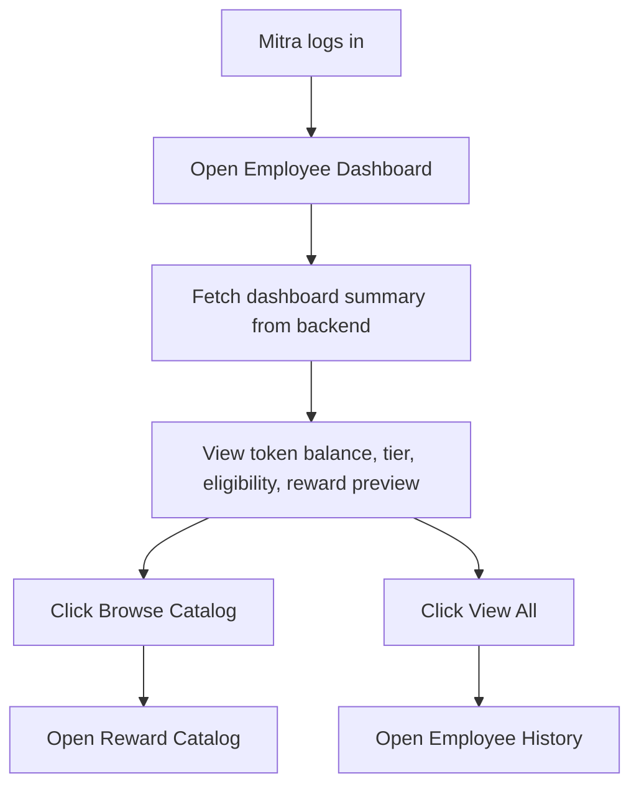
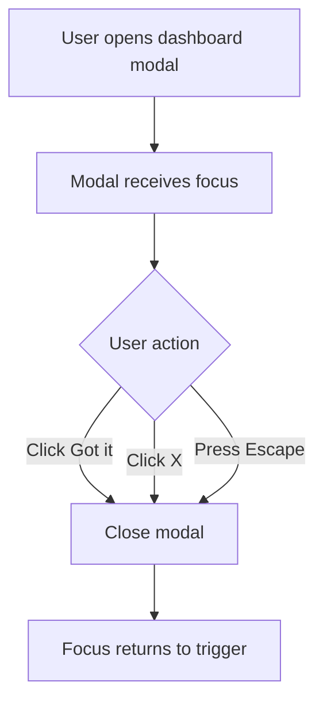
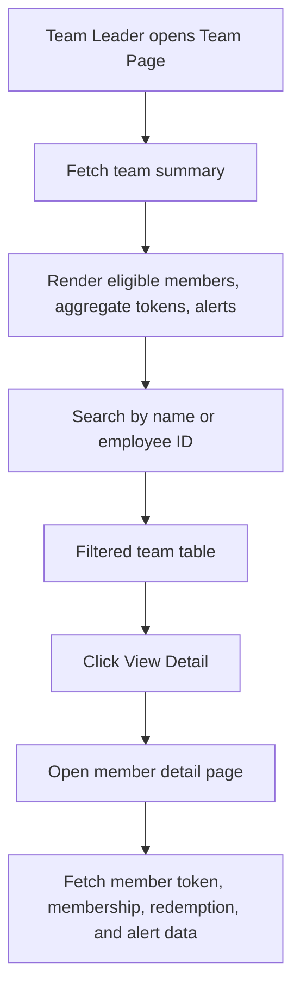
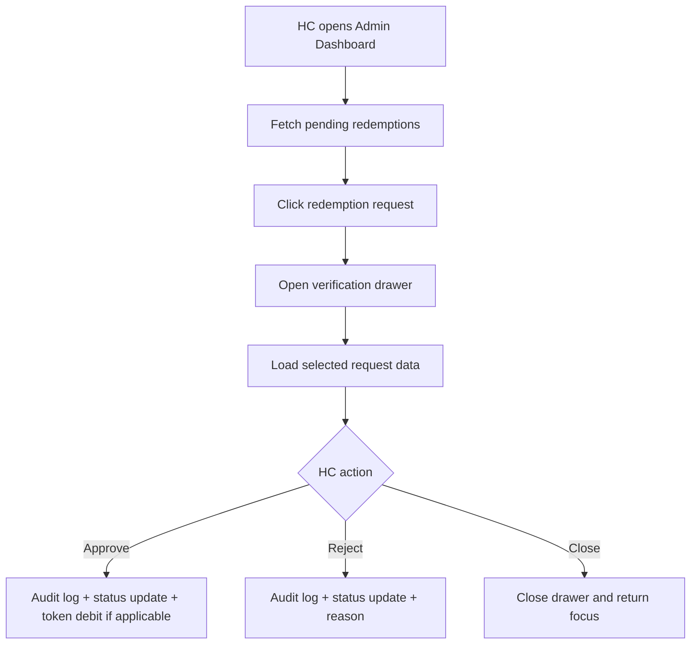

---

# PRD — Sprint 2.2 Loyalty Program Bugfix, Integration & UX Stabilization

**Product:** Berijalan Employee Loyalty Program Portal
**Document Version:** 2.2
**Date:** May 16, 2026
**Status:** Sprint Planning Draft
**Primary Goal:** Fix all confirmed UI interaction, navigation, modal, backend integration, and data consistency bugs found in `Temuan bug.md`, while preserving Sprint 2.1 architecture, design system, and business rules.

---

## 1. Overview

### 1.1 Product Context

The Berijalan Employee Loyalty Program Portal is an internal platform for Mitra, Human Capital, and Team Leader users to manage loyalty tokens, reward redemptions, membership tiers, operational data uploads, and status validation.

Sprint 2.1 established the stabilization baseline: backend validation, frontend consistency, role-based access, token ledger correctness, reward redemption flow, and auditability. Sprint 2.2 continues that stabilization work by focusing on actual QA findings from `Temuan bug.md`, especially broken click actions, incorrect routing, non-functional search, non-closable modals/drawers, inconsistent UI colors, hardcoded/mock data, and pages that are not integrated with backend data. 

A strong PRD should define product purpose, behavior, key features, user needs, and success criteria so cross-functional teams share a single implementation reference. ([Atlassian][1]) Acceptance criteria must be specific enough to remove ambiguity and define what “done” means for developers and QA. ([Atlassian][2])

---

## 2. Sprint 2.2 Objective

### 2.1 Sprint Goal

Sprint 2.2 focuses on **bugfix execution and real backend integration**.

By the end of Sprint 2.2:

1. All broken buttons, links, menu items, modals, drawers, and search components from `Temuan bug.md` must work correctly.
2. Employee dashboard, employee history, leader team page, admin dashboard, global dashboard shell, and login page must use real backend data where backend contracts already exist.
3. Mock/static placeholder data must be removed from production-facing pages.
4. Page layouts must follow the existing `DESIGN.md` system: modern clean bento layout, correct spacing, consistent color tokens, visible focus state, and accessible interaction states. 
5. Backend and frontend must follow Sprint 2.1 architecture rules: thin route/controller, service orchestration, repository-only database access, server-side RBAC, Zod validation, and audit logging for critical mutations. 
6. Critical bugfixes must be covered by E2E, integration, or unit tests depending on risk level.

### 2.2 Sprint Type

**Sprint Type:** Stabilization / Bugfix / Integration Sprint
**No major new business features should be introduced.**

---

## 3. Scope

### 3.1 In Scope

| Area                   | Scope                                                                                                                        |
| ---------------------- | ---------------------------------------------------------------------------------------------------------------------------- |
| Employee Dashboard     | Fix catalog navigation, view-all action, suspicious decorative elements, modal close behavior, and backend data integration. |
| Employee History       | Fix status chips/filter behavior and redemption history data binding.                                                        |
| Global Dashboard Shell | Fix logout, search, notification button, profile menu routing, and remove unused menu items.                                 |
| Login Page             | Fix validation error color state for NPK and password fields.                                                                |
| Leader Team Page       | Fix layout spacing, metric card colors, backend data integration, search behavior, and detail navigation.                    |
| Admin Dashboard        | Replace mock data with backend-driven data, fix upload/action buttons, and ensure drawers/modals close correctly.            |
| UI System              | Align colors, spacing, hover/focus states, and component semantics with `DESIGN.md`.                                         |
| Backend Contract       | Add or fix missing API endpoints required by bugfix pages.                                                                   |
| Testing                | Add E2E tests for all fixed user journeys.                                                                                   |

### 3.2 Out of Scope

| Item                                 | Reason                                                                                                                       |
| ------------------------------------ | ---------------------------------------------------------------------------------------------------------------------------- |
| AI reward recommendation engine      | Not required for bugfix sprint.                                                                                              |
| Full SSO production integration      | Still future scope from Sprint 2.1.                                                                                          |
| WhatsApp automation                  | Not required to fix current defects.                                                                                         |
| Advanced analytics dashboard         | Not part of current bug list.                                                                                                |
| Techno penalty policy implementation | Must remain blocked unless stakeholder confirms exact policy. Sprint 2.1 explicitly requires not hardcoding this open rule.  |
| New reward catalog business policy   | Only fix existing catalog routing and display behavior.                                                                      |

---

## 4. Source References

### 4.1 Internal Project References

| Source                              | Usage                                                                                                    |
| ----------------------------------- | -------------------------------------------------------------------------------------------------------- |
| `Temuan bug.md`                     | Primary defect source for Sprint 2.2.                                                                    |
| `PRD_Sprint_2_1_Loyalty_Program.md` | Template and business baseline for Sprint 2.2.                                                           |
| `DESIGN.md`                         | UI/UX design system reference.                                                                           |
| `AGENTS.md`                         | Engineering architecture, testing, and coding rules.                                                     |
| Loyalty Workflow SOP                | Business flow reference for token accumulation, redemption, validation, procurement, and monthly update. |

### 4.2 External Best-Practice References

| Reference                              | Applied Principle                                                                                         |
| -------------------------------------- | --------------------------------------------------------------------------------------------------------- |
| Atlassian PRD guidance                 | PRD should define product behavior, purpose, features, user needs, and success criteria. ([Atlassian][1]) |
| Atlassian acceptance criteria guidance | Each requirement must have predefined acceptance criteria as the definition of done. ([Atlassian][2])     |
| W3C WCAG guidance                      | Interactive UI must remain accessible, perceivable, operable, understandable, and robust. ([W3C][3])      |
| WCAG 2.1                               | Error states, focus visibility, status messages, and form validation must be accessible. ([W3C][4])       |
| Material Design dialog accessibility   | Dialogs must support clear user action and predictable dismissal behavior. ([Material Design][5])         |
| Material Design button accessibility   | Enabled buttons require sufficient contrast and accessible interaction states. ([Material Design][6])     |

---

## 5. Bug Classification

### 5.1 Severity Definition

| Severity | Definition                                                                                          | Sprint 2.2 Handling               |
| -------- | --------------------------------------------------------------------------------------------------- | --------------------------------- |
| S0       | Blocks login, logout, role access, token correctness, redemption correctness, or data integrity.    | Fix immediately.                  |
| S1       | Breaks primary user flow, backend integration, dashboard data, role navigation, or admin workflow.  | Must fix before sprint close.     |
| S2       | Broken UI action, modal close issue, incorrect color, spacing, validation message, or search issue. | Fix in Sprint 2.2.                |
| S3       | Pure cosmetic improvement with no functional impact.                                                | Fix only if in touched component. |

### 5.2 Sprint 2.2 Bug Themes

| Theme                   | Description                                                                              | Severity |
| ----------------------- | ---------------------------------------------------------------------------------------- | -------- |
| Broken Navigation       | Buttons or menu items do not route anywhere.                                             | S1       |
| Broken Interaction      | Buttons, filters, search, modal close, drawer close do not work.                         | S1/S2    |
| Backend Integration Gap | Pages display mock/static data instead of real database/backend data.                    | S1       |
| Incorrect UI Styling    | Colors, spacing, and component visuals do not follow `DESIGN.md`.                        | S2       |
| Accessibility Issue     | Clickable divs, missing focus states, unclear validation colors, modal close failure.    | S1/S2    |
| Redundant UI            | Unused menu items such as Payment Methods and duplicate Notifications should be removed. | S2       |

---

## 6. Requirements Summary

| ID           | Requirement                                           | Priority | Acceptance Criteria                                                                                                                                          |
| ------------ | ----------------------------------------------------- | -------: | ------------------------------------------------------------------------------------------------------------------------------------------------------------ |
| SPR22-REQ-01 | Fix Employee Dashboard navigation and modal behavior. |     Must | Browse Catalog routes to reward catalog; View All routes to full history/list page; modal closes through X, Got It, Escape, and outside click where allowed. |
| SPR22-REQ-02 | Integrate Employee Dashboard with backend.            |     Must | Token balance, tier, eligibility, reward preview, and token history come from authenticated backend APIs.                                                    |
| SPR22-REQ-03 | Fix Employee History filters/status chips.            |     Must | Total, Completed, Pending, and Rejected chips filter history correctly or are rendered as non-clickable summary chips if not intended as filters.            |
| SPR22-REQ-04 | Fix global dashboard shell actions.                   |     Must | Logout works; search is functional or removed; notification opens notification panel/page; profile menu routes to profile/reset-password.                    |
| SPR22-REQ-05 | Remove redundant menu items.                          |   Should | Payment Methods is removed; duplicate Notifications menu item is removed from profile dropdown.                                                              |
| SPR22-REQ-06 | Fix login validation visual state.                    |     Must | NPK and Password errors use visible destructive/error token and meet contrast requirements.                                                                  |
| SPR22-REQ-07 | Fix Leader Team layout and spacing.                   |     Must | Content has proper sidebar offset, responsive padding, and max-width according to dashboard shell pattern.                                                   |
| SPR22-REQ-08 | Integrate Leader Team metrics and table with backend. |     Must | Eligible members, aggregate tokens, alerts, team search, and member detail data come from backend.                                                           |
| SPR22-REQ-09 | Fix Leader Team search and View Detail.               |     Must | Search filters by name or employee ID; View Detail routes to member detail page with real backend data.                                                      |
| SPR22-REQ-10 | Fix Admin Dashboard backend integration.              |     Must | Dashboard cards, upload actions, redemption drawer, and pending queues use backend data, not hardcoded mock records.                                         |
| SPR22-REQ-11 | Fix modal/drawer close behavior globally.             |     Must | All dialogs/drawers support accessible close controls, focus management, and no trapped broken state.                                                        |
| SPR22-REQ-12 | Add regression tests for fixed bugs.                  |     Must | E2E tests cover employee dashboard, history, shell logout/search/notification/profile, login validation, leader team, and admin dashboard.                   |
| SPR22-REQ-13 | Preserve Sprint 2.1 backend rules.                    |     Must | No business logic in route handlers; service/repository boundaries remain intact; server-side RBAC remains enforced.                                         |
| SPR22-REQ-14 | Preserve design system.                               |     Must | No random hardcoded colors; use design tokens for surfaces, semantic states, buttons, inputs, cards, and focus rings.                                        |

---

## 7. Functional Requirements

## 7.1 Employee Dashboard

### Current Problems

The employee dashboard has multiple broken or suspicious UI elements: Browse Catalog does not route to catalog, View All is not clickable, chevron buttons appear visually odd, decorative span elements trigger strange modal behavior, and the modal cannot be closed through Got It or X controls. The page is also reported as not fully integrated with backend data. 

### Required Behavior

| ID          | Requirement                                                                                                            |
| ----------- | ---------------------------------------------------------------------------------------------------------------------- |
| EMP-DASH-01 | `Browse Catalog` button routes to `/employee/catalog` or the existing reward catalog route.                            |
| EMP-DASH-02 | `View All` routes to `/employee/history` or the full list related to the card context.                                 |
| EMP-DASH-03 | Chevron-only buttons must either perform a clear action or be removed.                                                 |
| EMP-DASH-04 | Decorative animated spans must not receive pointer events.                                                             |
| EMP-DASH-05 | Any modal opened from dashboard must close from `Got it`, X button, Escape key, and expected overlay behavior.         |
| EMP-DASH-06 | Token balance, token history, membership tier, redemption eligibility, and reward preview must come from backend APIs. |
| EMP-DASH-07 | Dashboard must include loading, empty, and error states.                                                               |

### Acceptance Criteria

```gherkin
Given I am logged in as MITRA
When I click Browse Catalog on the employee dashboard
Then I am navigated to the employee reward catalog page

Given a dashboard modal is open
When I click Got it or the X button
Then the modal closes and keyboard focus returns to the triggering element

Given backend returns employee loyalty summary
When I open /employee/dashboard
Then total tokens, membership tier, eligibility, and reward preview display real backend data
```

---

## 7.2 Employee History

### Current Problems

The history summary chips display Total Requests, Completed, Pending, and Rejected but are reported as “buttons” that cannot be clicked. 

### Required Behavior

| ID          | Requirement                                                                           |
| ----------- | ------------------------------------------------------------------------------------- |
| EMP-HIST-01 | Decide final behavior: status chips are either filters or read-only summary chips.    |
| EMP-HIST-02 | If filters, chips must be implemented as accessible buttons with selected state.      |
| EMP-HIST-03 | If read-only, chips must not look clickable and must not use button-like hover state. |
| EMP-HIST-04 | History list must fetch real redemption/token request history from backend.           |
| EMP-HIST-05 | Empty state must appear when no history exists.                                       |

### Acceptance Criteria

```gherkin
Given I am on /employee/history
When I click the Completed chip
Then the list only shows completed requests

Given there are no rejected requests
When I click Rejected
Then the page shows an empty state explaining there are no rejected requests
```

---

## 7.3 Global Dashboard Shell

### Current Problems

Logout does not work, search appears broken, notification button does nothing, Profile Settings does not route to profile/reset password, Payment Methods is unused, and duplicate Notifications item exists in the profile menu. 

### Required Behavior

| ID       | Requirement                                                                                          |
| -------- | ---------------------------------------------------------------------------------------------------- |
| SHELL-01 | Logout button must clear session/token and redirect to `/login`.                                     |
| SHELL-02 | Global search must either search across allowed entities or be removed/feature-flagged if not ready. |
| SHELL-03 | Notification button must open notification popover/page or display a planned empty state.            |
| SHELL-04 | Profile Settings routes to `/profile` or `/account/profile`.                                         |
| SHELL-05 | Profile page includes reset-password action or route to `/reset-password`.                           |
| SHELL-06 | Payment Methods menu item must be removed.                                                           |
| SHELL-07 | Duplicate Notifications item in profile dropdown must be removed.                                    |
| SHELL-08 | All shell actions must have keyboard and screen-reader-accessible semantics.                         |

### Acceptance Criteria

```gherkin
Given I am logged in
When I click logout
Then my session is cleared and I am redirected to /login

Given I open the profile dropdown
When I click Profile Settings
Then I am navigated to the profile page

Given I open the profile dropdown
Then I do not see Payment Methods
And I do not see duplicate Notifications menu item
```

---

## 7.4 Login Page Validation

### Current Problems

NPK and password validation messages exist but the error state is not visibly red/destructive enough. 

### Required Behavior

| ID       | Requirement                                                                |
| -------- | -------------------------------------------------------------------------- |
| LOGIN-01 | NPK required error uses semantic error/destructive color token.            |
| LOGIN-02 | Password minimum length error uses semantic error/destructive color token. |
| LOGIN-03 | Input border and helper text must show error state consistently.           |
| LOGIN-04 | Error messages must be connected to inputs using `aria-describedby`.       |
| LOGIN-05 | Login form must remain keyboard-accessible.                                |

WCAG guidance covers form validation, error identification, labels, focus, and accessible input assistance; Sprint 2.2 should use these as quality gates for login validation. ([W3C][4])

### Acceptance Criteria

```gherkin
Given I submit login with empty NPK
Then the NPK input border and error text use the error color token
And screen readers can associate the error text with the NPK field

Given I submit password shorter than 6 characters
Then the password field shows a visible destructive error state
```

---

## 7.5 Leader Team Page

### Current Problems

The leader team page is too close to the sidebar, card colors look inconsistent, metrics are not integrated with backend, search does not work, and View Detail does not route to a personal detail page. 

### Required Behavior

| ID             | Requirement                                                                           |
| -------------- | ------------------------------------------------------------------------------------- |
| LEADER-TEAM-01 | Page container must use dashboard shell spacing and sidebar-safe padding.             |
| LEADER-TEAM-02 | Metric cards must use design tokens, not arbitrary secondary/destructive backgrounds. |
| LEADER-TEAM-03 | Eligible members metric must come from backend.                                       |
| LEADER-TEAM-04 | Team aggregate tokens must come from backend.                                         |
| LEADER-TEAM-05 | Alerts count for reset/downgrade must come from backend.                              |
| LEADER-TEAM-06 | Search must filter by name and employee ID.                                           |
| LEADER-TEAM-07 | View Detail routes to `/leader/team/[employeeId]` or equivalent route.                |
| LEADER-TEAM-08 | Detail page must show real member token, membership, eligibility, and alert data.     |

### Acceptance Criteria

```gherkin
Given I am logged in as TEAM_LEADER
When I open /leader/team
Then eligible members, aggregate tokens, and alert counts are loaded from backend

Given I search by employee ID
When a matching team member exists
Then the table only shows matching members

Given I click View Detail on a member row
Then I am navigated to the member detail page
And the page displays real backend data for that member
```

---

## 7.6 Admin Dashboard

### Current Problems

Admin dashboard is reported as not using real database/backend data. Upload action, redemption verification drawer, request ID, mitra name, and pending status appear to use hardcoded/mock values.  

### Required Behavior

| ID            | Requirement                                                                   |
| ------------- | ----------------------------------------------------------------------------- |
| ADMIN-DASH-01 | Admin dashboard summary cards must fetch real backend metrics.                |
| ADMIN-DASH-02 | Upload Data File action must route to upload page or open upload drawer.      |
| ADMIN-DASH-03 | Verify Redemption drawer must use selected redemption request data.           |
| ADMIN-DASH-04 | Drawer close button must close drawer and return focus correctly.             |
| ADMIN-DASH-05 | Pending verification statuses must come from backend enums.                   |
| ADMIN-DASH-06 | Admin actions that mutate data must be audited according to Sprint 2.1 rules. |

Sprint 2.1 requires admin/system mutations such as redemption status changes, uploads, token adjustments, and reward item changes to be audit-logged. 

### Acceptance Criteria

```gherkin
Given I am logged in as HC
When I open /admin/dashboard
Then the dashboard shows metrics from backend

Given I click a redemption request
When the verification drawer opens
Then it shows the selected request ID, Mitra name, reward item, status, and eligibility data from backend

Given I close the drawer
Then the drawer disappears and focus returns to the previous trigger
```

---

## 8. Non-Functional Requirements

| Category        | Requirement                                                                                                    |
| --------------- | -------------------------------------------------------------------------------------------------------------- |
| Security        | All API calls must enforce server-side RBAC. UI role checks are not sufficient.                                |
| Data Integrity  | Token balance must remain derived from append-only token ledger.                                               |
| Auditability    | Admin/system mutations must create audit logs.                                                                 |
| Accessibility   | Buttons, menus, modals, search, forms, and drawers must meet WCAG 2.1 AA expectations.                         |
| UX              | Every async route must provide loading, empty, and error states.                                               |
| Maintainability | Do not mix backend services into frontend components.                                                          |
| Performance     | Avoid unnecessary client-side fetching for sensitive data. Prefer server-side data fetching where appropriate. |
| Testability     | Every fixed bug must have regression coverage.                                                                 |

---

## 9. Technical Requirements

## 9.1 Frontend Requirements

### Component Rules

| Component        | Requirement                                                                |
| ---------------- | -------------------------------------------------------------------------- |
| Button           | Must use semantic `<button>` or `<Link>` depending on behavior.            |
| Link Navigation  | Use Next.js `Link` for navigation actions.                                 |
| Icon-only Button | Must have `aria-label`.                                                    |
| Modal/Dialog     | Must have close control, Escape handling, focus trap, and focus return.    |
| Drawer           | Must close through X button and Escape key.                                |
| Search Input     | Must have controlled state, debounce if API-backed, and clear empty state. |
| Status Chip      | Must not look clickable unless it is interactive.                          |
| Form Input       | Must show error border, helper text, and `aria-describedby`.               |

Material Design guidance treats dialogs as important prompts in a user flow, so dialogs must not trap users in a non-dismissable state unless intentionally blocking and clearly justified. ([Material Design][5]) Enabled buttons should also maintain sufficient contrast against their backgrounds for accessibility. ([Material Design][6])

### Design Token Requirements

Use existing design tokens from `DESIGN.md`:

| Token Category                      | Usage                                    |
| ----------------------------------- | ---------------------------------------- |
| `--color-primary`                   | Main CTA only.                           |
| `--color-primary-hover`             | CTA hover.                               |
| `--color-error` / destructive token | Login validation and destructive states. |
| `--color-success`                   | Completed/approved states.               |
| `--color-warning`                   | Pending/attention states.                |
| `--color-border`                    | Card/input borders.                      |
| `--color-surface`                   | Cards, modals, dropdowns.                |
| `--radius-md` / `--radius-lg`       | Buttons, inputs, cards.                  |

The design system requires clean bento cards, strong hierarchy, generous spacing, Electric Indigo as primary action, and restrained accent usage. 

---

## 9.2 Backend Requirements

### API Contract Requirements

| Endpoint Area      | Required Contract                                                                                  |
| ------------------ | -------------------------------------------------------------------------------------------------- |
| Employee Dashboard | `GET /api/employee/dashboard-summary`                                                              |
| Employee History   | `GET /api/employee/history?status=`                                                                |
| Reward Catalog     | `GET /api/employee/rewards`                                                                        |
| Notifications      | `GET /api/notifications`                                                                           |
| Profile            | `GET /api/profile`, `PATCH /api/profile`, reset password route/action                              |
| Leader Team        | `GET /api/leader/team/summary`, `GET /api/leader/team/members`, `GET /api/leader/team/members/:id` |
| Admin Dashboard    | `GET /api/admin/dashboard-summary`, `GET /api/admin/redemptions/pending`                           |
| Upload             | Existing upload endpoint or route to upload workflow                                               |

### Backend Rules

1. Route/controller validates request and calls one service.
2. Service orchestrates business logic.
3. Repository performs database access only.
4. Domain logic stays pure TypeScript.
5. Zod validation is required for mutation payloads.
6. Server-side RBAC must deny unauthorized role access.
7. Audit log is required for mutation actions.

These rules are already defined in `AGENTS.md` and must remain non-negotiable in Sprint 2.2. 

---

## 10. User Flows

### 10.1 Employee Dashboard Flow



### 10.2 Employee Modal Flow



### 10.3 Leader Team Flow



### 10.4 Admin Redemption Verification Flow



---

## 11. Route-Level Fix Plan

| Route                       | Bugfix Scope                                                                          | Required Output                                           |
| --------------------------- | ------------------------------------------------------------------------------------- | --------------------------------------------------------- |
| `/employee/dashboard`       | Fix Browse Catalog, View All, chevron actions, modal close, backend data integration. | Functional dashboard with real data.                      |
| `/employee/history`         | Fix chips/filter behavior and real history data.                                      | Working status filter or clearly read-only summary chips. |
| Global dashboard shell      | Fix logout, search, notifications, profile menu, remove unused menu items.            | Functional app shell.                                     |
| `/login`                    | Fix destructive validation color and accessible error messages.                       | Clear error state.                                        |
| `/leader/team`              | Fix spacing, colors, backend metrics, search, View Detail route.                      | Integrated team summary and table.                        |
| `/leader/team/[employeeId]` | Add/fix detail page.                                                                  | Real member detail data.                                  |
| `/admin/dashboard`          | Replace mock data, fix upload action, fix redemption drawer.                          | Real admin metrics and pending redemption queue.          |

---

## 12. Data & Backend Integration Requirements

### 12.1 Employee Dashboard Data

```ts
type EmployeeDashboardSummary = {
  employeeId: string;
  name: string;
  currentTier: "SAPHIRE" | "EMERALD" | "RUBY" | "DIAMOND";
  tokenBalance: number;
  redeemableTokens: number;
  expiringTokens: {
    amount: number;
    expiryDate: string;
  }[];
  redemptionEligibility: {
    eligible: boolean;
    reason?: string;
  };
  recentTokenHistory: TokenHistoryItem[];
  rewardPreview: RewardPreviewItem[];
};
```

### 12.2 Leader Team Data

```ts
type LeaderTeamSummary = {
  leaderId: string;
  eligibleMemberCount: number;
  teamAggregateTokens: number;
  alertMemberCount: number;
  members: LeaderTeamMember[];
};

type LeaderTeamMember = {
  employeeId: string;
  name: string;
  division: "OPCENT" | "TELE" | "TECHNO";
  currentTier: string;
  tokenBalance: number;
  redemptionEligibility: boolean;
  alertStatus?: "DOWNGRADE_RISK" | "RESET_RISK" | "NONE";
};
```

### 12.3 Admin Dashboard Data

```ts
type AdminDashboardSummary = {
  activePeriod: string;
  totalUploadedFiles: number;
  pendingRedemptions: number;
  activeMembers: number;
  totalTokensIssued: number;
  recentUploads: UploadActivity[];
  redemptionQueue: RedemptionQueueItem[];
};
```

---

## 13. Testing Strategy

### 13.1 E2E Tests

| Test ID       | Flow                            | Expected Result                                     |
| ------------- | ------------------------------- | --------------------------------------------------- |
| E2E-SPR22-001 | Employee clicks Browse Catalog  | User lands on catalog page.                         |
| E2E-SPR22-002 | Employee clicks View All        | User lands on history/list page.                    |
| E2E-SPR22-003 | Employee opens and closes modal | Modal closes via Got It, X, and Escape.             |
| E2E-SPR22-004 | Employee filters history        | List updates based on selected status.              |
| E2E-SPR22-005 | User logs out from shell        | Session cleared and redirected to login.            |
| E2E-SPR22-006 | User opens notifications        | Notification panel/page appears.                    |
| E2E-SPR22-007 | User opens profile settings     | User lands on profile/reset-password flow.          |
| E2E-SPR22-008 | Login validation error          | Error text and input border show destructive state. |
| E2E-SPR22-009 | Leader searches team member     | Table filters correctly.                            |
| E2E-SPR22-010 | Leader clicks View Detail       | Detail page opens with real member data.            |
| E2E-SPR22-011 | Admin opens redemption drawer   | Drawer shows selected backend data.                 |
| E2E-SPR22-012 | Admin closes drawer             | Drawer closes and focus returns correctly.          |

### 13.2 Integration Tests

| Test ID       | Area                   | Expected Result                                  |
| ------------- | ---------------------- | ------------------------------------------------ |
| INT-SPR22-001 | Employee dashboard API | Returns authenticated employee summary only.     |
| INT-SPR22-002 | Employee history API   | Filters by redemption/token status.              |
| INT-SPR22-003 | Leader team API        | Returns only members under authenticated leader. |
| INT-SPR22-004 | Admin dashboard API    | Returns HC-only dashboard metrics.               |
| INT-SPR22-005 | Logout/session         | Session is invalidated correctly.                |
| INT-SPR22-006 | RBAC                   | MITRA cannot access HC or leader-only APIs.      |

### 13.3 Accessibility Tests

| Test ID        | Area                | Expected Result                                            |
| -------------- | ------------------- | ---------------------------------------------------------- |
| A11Y-SPR22-001 | Login errors        | Error text associated with input using `aria-describedby`. |
| A11Y-SPR22-002 | Icon buttons        | Every icon-only button has `aria-label`.                   |
| A11Y-SPR22-003 | Modal               | Focus is trapped while open and restored on close.         |
| A11Y-SPR22-004 | Drawer              | Escape closes drawer and close button is accessible.       |
| A11Y-SPR22-005 | Keyboard navigation | All interactive components are reachable with keyboard.    |

---

## 14. Definition of Done

Sprint 2.2 is accepted only when:

1. Every bug in `Temuan bug.md` has status: Fixed, Deferred with reason, or Not a Bug with evidence.
2. Employee dashboard uses real backend data and all major actions work.
3. Employee history filters or summary chips behave intentionally.
4. Global shell logout, profile, notification, and search behavior are fixed.
5. Login validation error state is visually clear and accessible.
6. Leader team page uses backend data and View Detail works.
7. Admin dashboard no longer uses hardcoded production-facing mock data.
8. All modals/drawers can be closed predictably.
9. UI uses `DESIGN.md` tokens and spacing rules.
10. Server-side RBAC remains enforced.
11. Critical mutation flows still produce audit logs.
12. Regression tests are added and passing.
13. No new large feature is introduced outside bugfix scope.

---

## 15. Sprint 2.2 Execution Plan

### Phase 1 — Bug Reproduction & Mapping

| Task                                     | Owner   | Output                                                               |
| ---------------------------------------- | ------- | -------------------------------------------------------------------- |
| Reproduce each bug from `Temuan bug.md`. | QA + FE | Bug matrix with route, selector, expected behavior, actual behavior. |
| Map each bug to requirement ID.          | SA/PM   | Sprint 2.2 backlog.                                                  |
| Identify backend contract gaps.          | BE + FE | API contract checklist.                                              |

### Phase 2 — Backend Integration Fix

| Task                                                      | Owner | Output                             |
| --------------------------------------------------------- | ----- | ---------------------------------- |
| Implement/fix employee dashboard summary API.             | BE    | Working employee summary endpoint. |
| Implement/fix employee history API.                       | BE    | Filterable history endpoint.       |
| Implement/fix leader team summary and member detail APIs. | BE    | Team endpoints with RBAC.          |
| Implement/fix admin dashboard and redemption queue APIs.  | BE    | HC-only admin endpoints.           |
| Add integration tests.                                    | BE/QA | Passing backend tests.             |

### Phase 3 — Frontend Interaction Fix

| Task                                               | Owner | Output                                         |
| -------------------------------------------------- | ----- | ---------------------------------------------- |
| Fix employee dashboard actions and modal behavior. | FE    | Working dashboard.                             |
| Fix history chips/filter UI.                       | FE    | Clear filter or read-only behavior.            |
| Fix global shell actions.                          | FE    | Working logout, notification, profile, search. |
| Fix login validation colors and accessibility.     | FE    | Accessible error state.                        |
| Fix leader team layout/search/detail route.        | FE    | Working leader team flow.                      |
| Fix admin dashboard/drawer behavior.               | FE    | Working admin dashboard.                       |

### Phase 4 — Design System Cleanup

| Task                                                | Owner | Output                      |
| --------------------------------------------------- | ----- | --------------------------- |
| Replace arbitrary colors with tokens.               | FE    | Consistent UI.              |
| Normalize spacing from sidebar and dashboard shell. | FE    | Layout follows bento shell. |
| Remove unused menu items.                           | FE    | Cleaner navigation.         |
| Verify focus/hover/active states.                   | FE/QA | Accessible interactions.    |

### Phase 5 — Regression Testing

| Task                                          | Owner    | Output                       |
| --------------------------------------------- | -------- | ---------------------------- |
| Add Cypress/Playwright specs for fixed flows. | QA/FE    | E2E regression suite.        |
| Add API integration tests.                    | BE       | Backend regression coverage. |
| Run accessibility checks.                     | QA       | A11Y report.                 |
| Final bug triage.                             | PM/SA/QA | Sprint closure report.       |

---

## 16. Suggested Sprint Backlog

| Ticket ID     | Title                                                        | Severity | Owner |
| ------------- | ------------------------------------------------------------ | -------: | ----- |
| SPR22-BUG-001 | Fix Employee Dashboard Browse Catalog navigation.            |       S1 | FE    |
| SPR22-BUG-002 | Fix Employee Dashboard View All navigation.                  |       S1 | FE    |
| SPR22-BUG-003 | Remove or wire chevron-only dashboard actions.               |       S2 | FE    |
| SPR22-BUG-004 | Fix dashboard modal close behavior.                          |       S1 | FE    |
| SPR22-BUG-005 | Integrate Employee Dashboard with backend summary API.       |       S1 | FE/BE |
| SPR22-BUG-006 | Fix Employee History status chips/filter behavior.           |       S2 | FE    |
| SPR22-BUG-007 | Integrate Employee History with backend.                     |       S1 | FE/BE |
| SPR22-BUG-008 | Fix global logout action.                                    |       S0 | FE/BE |
| SPR22-BUG-009 | Fix or feature-flag global search.                           |       S2 | FE/BE |
| SPR22-BUG-010 | Fix notification button behavior.                            |       S2 | FE    |
| SPR22-BUG-011 | Fix Profile Settings route and reset password path.          |       S1 | FE    |
| SPR22-BUG-012 | Remove Payment Methods menu item.                            |       S2 | FE    |
| SPR22-BUG-013 | Remove duplicate Notifications dropdown item.                |       S2 | FE    |
| SPR22-BUG-014 | Fix login validation destructive color state.                |       S2 | FE    |
| SPR22-BUG-015 | Fix Leader Team page spacing from sidebar.                   |       S2 | FE    |
| SPR22-BUG-016 | Fix Leader Team metric card colors.                          |       S2 | FE    |
| SPR22-BUG-017 | Integrate Leader Team metrics with backend.                  |       S1 | FE/BE |
| SPR22-BUG-018 | Fix Leader Team search.                                      |       S1 | FE    |
| SPR22-BUG-019 | Fix Leader Team View Detail route.                           |       S1 | FE/BE |
| SPR22-BUG-020 | Integrate Admin Dashboard with backend.                      |       S1 | FE/BE |
| SPR22-BUG-021 | Fix Admin Upload Data File action.                           |       S1 | FE    |
| SPR22-BUG-022 | Fix Admin Redemption drawer close and selected data binding. |       S1 | FE/BE |
| SPR22-BUG-023 | Add Sprint 2.2 E2E regression tests.                         |       S1 | QA/FE |
| SPR22-BUG-024 | Add Sprint 2.2 backend integration tests.                    |       S1 | QA/BE |

---

## 17. Engineering Guardrails

### 17.1 Frontend Guardrails

* Use `Link` for navigation.
* Use semantic `button` for actions.
* Do not use clickable `div` unless unavoidable and fully accessible.
* Do not select E2E elements by volatile CSS class.
* Keep `data-testid` only for stable test selectors.
* Keep loading, empty, and error states for all backend-driven pages.
* Do not introduce random hardcoded colors.
* Use design tokens from `DESIGN.md`.

### 17.2 Backend Guardrails

* Route/controller must remain thin.
* Use Zod for mutation validation.
* Enforce server-side RBAC.
* Services orchestrate business logic.
* Repositories handle database only.
* Domain logic remains pure TypeScript.
* Token ledger remains append-only.
* Admin/system mutations require audit logs.

### 17.3 QA Guardrails

* Every bugfix needs reproduction evidence before and after.
* Every fixed critical flow needs automated regression test.
* Test desktop, tablet, and mobile breakpoints.
* Test keyboard-only navigation.
* Test role-specific access.

---

## 18. Open Questions

| ID                     | Question                                                                          | Owner      | Sprint 2.2 Handling                                                           |
| ---------------------- | --------------------------------------------------------------------------------- | ---------- | ----------------------------------------------------------------------------- |
| OQ-SPR22-SEARCH        | Should global search search rewards, history, members, or all available entities? | Product/HC | If unclear, feature-flag or limit search to current route context.            |
| OQ-SPR22-NOTIFICATION  | Should notification button open popover, page, or drawer?                         | Product/HC | Minimum: open notification empty state or page.                               |
| OQ-SPR22-PROFILE       | Should reset password be inside profile page or separate `/reset-password` route? | Product/IT | Minimum: Profile Settings must route to a usable profile/reset-password flow. |
| OQ-SPR22-HISTORY-CHIPS | Are history chips intended as filters or static summary cards?                    | Product/QA | Prefer filters because user reported them as buttons.                         |
| OQ-SPR22-ADMIN-UPLOAD  | Should upload open drawer or route to upload page?                                | Product/HC | Use existing project pattern.                                                 |

---

## 19. Recommended File Name

```txt
PRD_Sprint_2_2_Loyalty_Program_Bugfix_Integration.md
```

## 20. Recommended Commit Scope

```txt
docs(prd): add Sprint 2.2 bugfix and integration PRD
```

---

[1]: https://www.atlassian.com/agile/product-management/requirements?utm_source=chatgpt.com "What is a Product Requirements Document (PRD)?"
[2]: https://www.atlassian.com/work-management/project-management/acceptance-criteria?utm_source=chatgpt.com "What is Acceptance Criteria? Definition, Examples, & Tips"
[3]: https://www.w3.org/WAI/standards-guidelines/wcag/?utm_source=chatgpt.com "WCAG 2 Overview | Web Accessibility Initiative (WAI)"
[4]: https://www.w3.org/TR/WCAG21/?utm_source=chatgpt.com "Web Content Accessibility Guidelines (WCAG) 2.1"
[5]: https://m3.material.io/components/dialogs/accessibility?utm_source=chatgpt.com "Dialogs – Material Design 3"
[6]: https://m3.material.io/components/buttons/accessibility?utm_source=chatgpt.com "Buttons – Material Design 3"

---


1.  on [http://localhost:3000/employee/dashboard](http://localhost:3000/employee/dashboard)    
- button \<button class="btn btn-primary h-9 rounded-md px-3 text-xs w-full btn-primary" data-testid="employee-dashboard-redeem-button"\>Browse Catalog\<svg xmlns="http://www.w3.org/2000/svg" width="24" height="24" viewBox="0 0 24 24" fill="none" stroke="currentColor" stroke-width="2" stroke-linecap="round" stroke-linejoin="round" class="lucide lucide-arrow-up-right ml-1 h-3 w-3" aria-hidden="true"\>\<path d="M7 7h10v10"\>\</path\>\<path d="M7 17 17 7"\>\</path\>\</svg\>\</button\> cannot be clicked and does not point anywhere, it should be able to and point to the catalog page  
- \<button class="btn hover:text-slate-900 dark:hover:bg-slate-800 dark:hover:text-slate-50 h-9 rounded-md px-3 text-xs font-bold uppercase tracking-widest hover:bg-slate-50"\>View All\<svg xmlns="http://www.w3.org/2000/svg" width="24" height="24" viewBox="0 0 24 24" fill="none" stroke="currentColor" stroke-width="2" stroke-linecap="round" stroke-linejoin="round" class="lucide lucide-chevron-right ml-1 h-3 w-3" aria-hidden="true"\>\<path d="m9 18 6-6-6-6"\>\</path\>\</svg\>\</button\> ini tidak bisa diklik   
- \<button class="p-1 rounded-full hover:bg-slate-100 transition-colors" tabindex="0" style="transform: none;"\>\<svg xmlns="http://www.w3.org/2000/svg" width="24" height="24" viewBox="0 0 24 24" fill="none" stroke="currentColor" stroke-width="2" stroke-linecap="round" stroke-linejoin="round" class="lucide lucide-chevron-right h-4 w-4 text-muted-foreground" aria-hidden="true"\>\<path d="m9 18 6-6-6-6"\>\</path\>\</svg\>\</button\> ini aneh elementnya   
- \<span class="absolute inset-0 rounded-full border border-primary/30" style="opacity: 0; transform: scale(1.5);"\>\</span\> ini juga aneh elementnya dan kalau diklik muncul modal tapi tidak bisa diclose modalnya \<button class="btn btn-secondary min-h-\[44px\] px-4 py-2"\>Got it\</button\> dan \<div class="p-1 rounded-full hover:bg-slate-100 cursor-pointer" tabindex="0" style="transform: none;"\>\<svg xmlns="http://www.w3.org/2000/svg" width="24" height="24" viewBox="0 0 24 24" fill="none" stroke="currentColor" stroke-width="2" stroke-linecap="round" stroke-linejoin="round" class="lucide lucide-x h-4 w-4 text-muted-foreground" aria-hidden="true"\>\<path d="M18 6 6 18"\>\</path\>\<path d="m6 6 12 12"\>\</path\>\</svg\>\</div\> 

2. On [http://localhost:3000/employee/history](http://localhost:3000/employee/history)   
   1. \<div class="flex flex-wrap gap-3"\>\<div class="flex items-center gap-2 rounded-full border border-border bg-muted/30 px-4 py-1.5"\>\<span class="text-xs text-muted-foreground"\>Total Requests:\</span\>\<span class="text-sm font-bold text-foreground"\>3\</span\>\</div\>\<div class="flex items-center gap-2 rounded-full border border-border bg-muted/30 px-4 py-1.5"\>\<span class="text-xs text-muted-foreground"\>Completed:\</span\>\<span class="text-sm font-bold text-foreground"\>1\</span\>\</div\>\<div class="flex items-center gap-2 rounded-full border border-border bg-muted/30 px-4 py-1.5"\>\<span class="text-xs text-muted-foreground"\>Pending:\</span\>\<span class="text-sm font-bold text-foreground"\>0\</span\>\</div\>\<div class="flex items-center gap-2 rounded-full border border-border bg-muted/30 px-4 py-1.5"\>\<span class="text-xs text-muted-foreground"\>Rejected:\</span\>\<span class="text-sm font-bold text-foreground"\>1\</span\>\</div\>\</div\> semua button ini tidak bisa diklik   
3. On the general dashboard  
   1. \<div class="text-muted-foreground" style="transform: none;"\>\<svg xmlns="http://www.w3.org/2000/svg" width="14" height="14" viewBox="0 0 24 24" fill="none" stroke="currentColor" stroke-width="2" stroke-linecap="round" stroke-linejoin="round" class="lucide lucide-log-out" aria-hidden="true"\>\<path d="m16 17 5-5-5-5"\>\</path\>\<path d="M21 12H9"\>\</path\>\<path d="M9 21H5a2 2 0 0 1-2-2V5a2 2 0 0 1 2-2h4"\>\</path\>\</svg\>\</div\> button logout ini tidak bisa diklik   
   2. Search ini aneh dan tidak bisa digunakan \<div class="hidden md:flex items-center gap-2 px-4 py-2 rounded-xl border transition-all duration-300 bg-slate-50 border-border" style="opacity: 1; width: auto;"\>\<div style="transform: none;"\>\<svg xmlns="http://www.w3.org/2000/svg" width="16" height="16" viewBox="0 0 24 24" fill="none" stroke="currentColor" stroke-width="2" stroke-linecap="round" stroke-linejoin="round" class="lucide lucide-search transition-colors text-muted-foreground" aria-hidden="true"\>\<path d="m21 21-4.34-4.34"\>\</path\>\<circle cx="11" cy="11" r="8"\>\</circle\>\</svg\>\</div\>\<input type="text" placeholder="Search..." class="bg-transparent border-none outline-none text-sm text-foreground placeholder:text-muted-foreground w-32 focus:outline-none transition-all"\>\<div class="text-muted-foreground" style="transform: none;"\>\<svg xmlns="http://www.w3.org/2000/svg" width="14" height="14" viewBox="0 0 24 24" fill="none" stroke="currentColor" stroke-width="2" stroke-linecap="round" stroke-linejoin="round" class="lucide lucide-log-out" aria-hidden="true"\>\<path d="m16 17 5-5-5-5"\>\</path\>\<path d="M21 12H9"\>\</path\>\<path d="M9 21H5a2 2 0 0 1-2-2V5a2 2 0 0 1 2-2h4"\>\</path\>\</svg\>\</div\>\</div\>   
   3. notifikasi ini tidak bisa digunakana dan tidak mengarah kemanapun \<button class="relative p-2.5 text-muted-foreground hover:text-foreground rounded-xl hover:bg-slate-100 transition-colors" tabindex="0" style="transform: none;"\>\<svg xmlns="http://www.w3.org/2000/svg" width="20" height="20" viewBox="0 0 24 24" fill="none" stroke="currentColor" stroke-width="2" stroke-linecap="round" stroke-linejoin="round" class="lucide lucide-bell" aria-hidden="true"\>\<path d="M10.268 21a2 2 0 0 0 3.464 0"\>\</path\>\<path d="M3.262 15.326A1 1 0 0 0 4 17h16a1 1 0 0 0 .74-1.673C19.41 13.956 18 12.499 18 8A6 6 0 0 0 6 8c0 4.499-1.411 5.956-2.738 7.326"\>\</path\>\</svg\>\<span class="absolute top-1.5 right-1.5 h-2 w-2 bg-primary rounded-full" style="transform: none;"\>\<span class="absolute inset-0 h-full w-full rounded-full bg-primary" style="transform: scale(1.44685);"\>\</span\>\</span\>\</button\>   
   4. \<div role="menuitem" id="base-ui-\_r\_1b\_" tabindex="-1" data-slot="dropdown-menu-item" data-variant="default" class="group/dropdown-menu-item relative text-sm outline-hidden select-none focus:text-accent-foreground not-data-\[variant=destructive\]:focus:\*\*:text-accent-foreground data-inset:pl-7 data-\[variant=destructive\]:text-destructive data-\[variant=destructive\]:focus:bg-destructive/10 data-\[variant=destructive\]:focus:text-destructive dark:data-\[variant=destructive\]:focus:bg-destructive/20 data-disabled:pointer-events-none data-disabled:opacity-50 \[\&amp;\_svg\]:pointer-events-none \[\&amp;\_svg\]:shrink-0 \[\&amp;\_svg:not(\[class\*='size-'\])\]:size-4 data-\[variant=destructive\]:\*:\[svg\]:text-destructive flex items-center gap-3 px-3 py-2.5 rounded-lg cursor-pointer transition-colors hover:bg-slate-100 focus:bg-slate-100"\>\<div\>\<svg xmlns="http://www.w3.org/2000/svg" width="16" height="16" viewBox="0 0 24 24" fill="none" stroke="currentColor" stroke-width="2" stroke-linecap="round" stroke-linejoin="round" class="lucide lucide-user" aria-hidden="true"\>\<path d="M19 21v-2a4 4 0 0 0-4-4H9a4 4 0 0 0-4 4v2"\>\</path\>\<circle cx="12" cy="7" r="4"\>\</circle\>\</svg\>\</div\>\<span\>Profile Settings\</span\>\</div\> ini tidak bisa digunakan seharusnya bisa reset password apabila diklik dan mengarah ke page profile .   
   5. ini dihapus saja karena tidak berguna \<div role="menuitem" id="base-ui-\_r\_1c\_" tabindex="-1" data-slot="dropdown-menu-item" data-variant="default" class="group/dropdown-menu-item relative text-sm outline-hidden select-none focus:text-accent-foreground not-data-\[variant=destructive\]:focus:\*\*:text-accent-foreground data-inset:pl-7 data-\[variant=destructive\]:text-destructive data-\[variant=destructive\]:focus:bg-destructive/10 data-\[variant=destructive\]:focus:text-destructive dark:data-\[variant=destructive\]:focus:bg-destructive/20 data-disabled:pointer-events-none data-disabled:opacity-50 \[\&amp;\_svg\]:pointer-events-none \[\&amp;\_svg\]:shrink-0 \[\&amp;\_svg:not(\[class\*='size-'\])\]:size-4 data-\[variant=destructive\]:\*:\[svg\]:text-destructive flex items-center gap-3 px-3 py-2.5 rounded-lg cursor-pointer transition-colors hover:bg-slate-100 focus:bg-slate-100"\>\<div style="transform: none;"\>\<svg xmlns="http://www.w3.org/2000/svg" width="16" height="16" viewBox="0 0 24 24" fill="none" stroke="currentColor" stroke-width="2" stroke-linecap="round" stroke-linejoin="round" class="lucide lucide-credit-card" aria-hidden="true"\>\<rect width="20" height="14" x="2" y="5" rx="2"\>\</rect\>\<line x1="2" x2="22" y1="10" y2="10"\>\</line\>\</svg\>\</div\>\<span\>Payment Methods\</span\>\</div\>   
   6. ini juga dihapus saja karena sudah ada di app bar , \<div role="menuitem" id="base-ui-\_r\_1d\_" tabindex="-1" data-slot="dropdown-menu-item" data-variant="default" class="group/dropdown-menu-item relative text-sm outline-hidden select-none focus:text-accent-foreground not-data-\[variant=destructive\]:focus:\*\*:text-accent-foreground data-inset:pl-7 data-\[variant=destructive\]:text-destructive data-\[variant=destructive\]:focus:bg-destructive/10 data-\[variant=destructive\]:focus:text-destructive dark:data-\[variant=destructive\]:focus:bg-destructive/20 data-disabled:pointer-events-none data-disabled:opacity-50 \[\&amp;\_svg\]:pointer-events-none \[\&amp;\_svg\]:shrink-0 \[\&amp;\_svg:not(\[class\*='size-'\])\]:size-4 data-\[variant=destructive\]:\*:\[svg\]:text-destructive flex items-center gap-3 px-3 py-2.5 rounded-lg cursor-pointer transition-colors hover:bg-slate-100 focus:bg-slate-100"\>\<div style="transform: none;"\>\<svg xmlns="http://www.w3.org/2000/svg" width="16" height="16" viewBox="0 0 24 24" fill="none" stroke="currentColor" stroke-width="2" stroke-linecap="round" stroke-linejoin="round" class="lucide lucide-bell" aria-hidden="true"\>\<path d="M10.268 21a2 2 0 0 0 3.464 0"\>\</path\>\<path d="M3.262 15.326A1 1 0 0 0 4 17h16a1 1 0 0 0 .74-1.673C19.41 13.956 18 12.499 18 8A6 6 0 0 0 6 8c0 4.499-1.411 5.956-2.738 7.326"\>\</path\>\</svg\>\</div\>\<span\>Notifications\</span\>\</div\> 

4. On the page[http://localhost:3000/login](http://localhost:3000/login)   
   1. \<p class="text-xs text-destructive"\>NPK is required\</p\> should be red in the error state  
   2. \<p class="text-xs text-destructive"\>Password must be at least 6 characters\</p\> should be red in error state  
5. On the page[http://localhost:3000/leader/team](http://localhost:3000/leader/team)Overall, the page element is too close to the sidebar. Please fix the padding and margins.  
   1. \<div class="flex items-center gap-4 rounded-xl border p-6 transition-colors bg-secondary/5 border-secondary/20" data-testid="leader-team-eligible-members"\>\<div class="flex h-12 w-12 shrink-0 items-center justify-center rounded-full bg-secondary/15 text-secondary"\>\<svg xmlns="http://www.w3.org/2000/svg" width="24" height="24" viewBox="0 0 24 24" fill="none" stroke="currentColor" stroke-width="2" stroke-linecap="round" stroke-linejoin="round" class="lucide lucide-users h-6 w-6" aria-hidden="true"\>\<path d="M16 21v-2a4 4 0 0 0-4-4H6a4 4 0 0 0-4 4v2"\>\</path\>\<path d="M16 3.128a4 4 0 0 1 0 7.744"\>\</path\>\<path d="M22 21v-2a4 4 0 0 0-3-3.87"\>\</path\>\<circle cx="9" cy="7" r="4"\>\</circle\>\</svg\>\</div\>\<div class="min-w-0"\>\<p class="text-xs font-semibold uppercase tracking-wider text-secondary"\>Eligible for Rewards\</p\>\<p class="text-2xl font-bold text-foreground truncate"\>3 Members\</p\>\<p class="text-xs text-muted-foreground mt-0.5"\>Have 2,000+ tokens\</p\>\</div\>\</div\> warna tidak sesuai best practice , dan tidak integrate dengan backend   
   2. \<div class="flex items-center gap-4 rounded-xl border p-6 transition-colors bg-primary/5 border-primary/20" data-testid="leader-team-total-tokens"\>\<div class="flex h-12 w-12 shrink-0 items-center justify-center rounded-full bg-primary/15 text-primary"\>\<svg xmlns="http://www.w3.org/2000/svg" width="24" height="24" viewBox="0 0 24 24" fill="none" stroke="currentColor" stroke-width="2" stroke-linecap="round" stroke-linejoin="round" class="lucide lucide-coins h-6 w-6" aria-hidden="true"\>\<path d="M13.744 17.736a6 6 0 1 1-7.48-7.48"\>\</path\>\<path d="M15 6h1v4"\>\</path\>\<path d="m6.134 14.768.866-.5 2 3.464"\>\</path\>\<circle cx="16" cy="8" r="6"\>\</circle\>\</svg\>\</div\>\<div class="min-w-0"\>\<p class="text-xs font-semibold uppercase tracking-wider text-primary"\>Team Aggregate Tokens\</p\>\<p class="text-2xl font-bold text-foreground truncate"\>17,900\</p\>\<p class="text-xs text-muted-foreground mt-0.5"\>Combined across all members\</p\>\</div\>\</div\> sama warna aneh dan tidak integrate dengan backend   
   3. \<div class="flex items-center gap-4 rounded-xl border p-6 transition-colors bg-destructive/5 border-destructive/20" data-testid="leader-team-alerts-count"\>\<div class="flex h-12 w-12 shrink-0 items-center justify-center rounded-full bg-destructive/15 text-destructive"\>\<svg xmlns="http://www.w3.org/2000/svg" width="24" height="24" viewBox="0 0 24 24" fill="none" stroke="currentColor" stroke-width="2" stroke-linecap="round" stroke-linejoin="round" class="lucide lucide-triangle-alert h-6 w-6" aria-hidden="true"\>\<path d="m21.73 18-8-14a2 2 0 0 0-3.48 0l-8 14A2 2 0 0 0 4 21h16a2 2 0 0 0 1.73-3"\>\</path\>\<path d="M12 9v4"\>\</path\>\<path d="M12 17h.01"\>\</path\>\</svg\>\</div\>\<div class="min-w-0"\>\<p class="text-xs font-semibold uppercase tracking-wider text-destructive"\>Alerts (Reset/Downgrade)\</p\>\<p class="text-2xl font-bold text-foreground truncate"\>2 Members\</p\>\<p class="text-xs text-muted-foreground mt-0.5"\>Need attention\</p\>\</div\>\</div\> Sama aneh warnanya dan tidak integrate dengan backend   
   4. \<input class="input-field pl-9 bg-muted/30" placeholder="Search by name or employee ID..." value=""\> The search design is weird and doesn't work.  
   5. \<button class="text-sm text-primary font-medium hover:underline" data-testid="leader-team-table-action-view" tabindex="0" style="transform: none;"\>View Detail\</button\> this is not working it should be able to see personal page details and integrate with backend and data  
   6.   
6. On [http://localhost:3000/employee/dashboard](http://localhost:3000/employee/dashboard)Not yet integrated with the backend and does not display real data in its entirety.  
   1. \<span class="absolute inset-0 rounded-full border border-primary/30" style="opacity: 0; transform: scale(1.5);"\>\</span\> this is weird and the modal is also weird, it can't be closed  
   2. \<button class="btn btn-primary h-9 rounded-md px-3 text-xs w-full btn-primary" data-testid="employee-dashboard-redeem-button"\>Browse Catalog\<svg xmlns="http://www.w3.org/2000/svg" width="24" height="24" viewBox="0 0 24 24" fill="none" stroke="currentColor" stroke-width="2" stroke-linecap="round" stroke-linejoin="round" class="lucide lucide-arrow-up-right ml-1 h-3 w-3" aria-hidden="true"\>\<path d="M7 7h10v10"\>\</path\>\<path d="M7 17 17 7"\>\</path\>\</svg\>\</button\> tidak bisa diklik dan tidak mengarah pada browse catalog   
   3. \<button class="btn hover:text-slate-900 dark:hover:bg-slate-800 dark:hover:text-slate-50 h-9 rounded-md px-3 text-xs font-bold uppercase tracking-widest hover:bg-slate-50"\>View All\<svg xmlns="http://www.w3.org/2000/svg" width="24" height="24" viewBox="0 0 24 24" fill="none" stroke="currentColor" stroke-width="2" stroke-linecap="round" stroke-linejoin="round" class="lucide lucide-chevron-right ml-1 h-3 w-3" aria-hidden="true"\>\<path d="m9 18 6-6-6-6"\>\</path\>\</svg\>\</button\> ini designya aneh dan tidak bisa diklik .   
   4. \<button class="p-1 rounded-full hover:bg-slate-100 transition-colors" tabindex="0" style="transform: none;"\>\<svg xmlns="http://www.w3.org/2000/svg" width="24" height="24" viewBox="0 0 24 24" fill="none" stroke="currentColor" stroke-width="2" stroke-linecap="round" stroke-linejoin="round" class="lucide lucide-chevron-right h-4 w-4 text-muted-foreground" aria-hidden="true"\>\<path d="m9 18 6-6-6-6"\>\</path\>\</svg\>\</button\> ini designnya aneh 

7. On the page[http://localhost:3000/admin/dashboard](http://localhost:3000/admin/dashboard)The data is not real and does not integrate with the real database and backend.  
   1. \<div class="space-y-4"\>\<button class="btn-primary w-full text-left flex justify-between items-center px-4 py-3" tabindex="0" style="transform: none;"\>Upload Data File\<svg xmlns="http://www.w3.org/2000/svg" width="24" height="24" viewBox="0 0 24 24" fill="none" stroke="currentColor" stroke-width="2" stroke-linecap="round" stroke-linejoin="round" class="lucide lucide-upload h-4 w-4" aria-hidden="true"\>\<path d="M12 3v12"\>\</path\>\<path d="m17 8-5-5-5 5"\>\</path\>\<path d="M21 15v4a2 2 0 0 1-2 2H5a2 2 0 0 1-2-2v-4"\>\</path\>\</svg\>\</button\>\<button class="btn-ghost w-full text-left flex justify-between items-center px-4 py-3" tabindex="0" style="transform: none;"\>Process Month End\<svg xmlns="http://www.w3.org/2000/svg" width="24" height="24" viewBox="0 0 24 24" fill="none" stroke="currentColor" stroke-width="2" stroke-linecap="round" stroke-linejoin="round" class="lucide lucide-chevron-right h-4 w-4" aria-hidden="true"\>\<path d="m9 18 6-6-6-6"\>\</path\>\</svg\>\</button\>\<button class="btn-ghost w-full text-left flex justify-between items-center px-4 py-3 text-\[--color-error\]" tabindex="0" style="transform: none;"\>Run Downgrade Job\<svg xmlns="http://www.w3.org/2000/svg" width="24" height="24" viewBox="0 0 24 24" fill="none" stroke="currentColor" stroke-width="2" stroke-linecap="round" stroke-linejoin="round" class="lucide lucide-chevron-right h-4 w-4" aria-hidden="true"\>\<path d="m9 18 6-6-6-6"\>\</path\>\</svg\>\</button\>\</div\> semua button tidak bisa diklik dan tidak mengarah kemanapun, seharusnya mengarah ke page yang sesuai dan tidak dummy  .   
   2. \<div class="bento-card p-6" style="opacity: 1; transform: none;"\>\<h3 class="text-card-heading mb-6 text-\[--color-error\]"\>Manual Token Adjustment\</h3\>\<div class="space-y-4"\>\<div\>\<label class="text-label block mb-1" for="adj-mitra-id"\>Mitra ID / Email\</label\>\<input id="adj-mitra-id" data-testid="adj-mitra-id" class="input-field input-field--error" aria-invalid="true" name="mitraId" aria-describedby="adj-mitra-error"\>\<p id="adj-mitra-error" role="alert" class="text-xs text-\[--color-error\] mt-1 transition-opacity duration-200 opacity-100"\>Mitra ID is required\</p\>\</div\>\<div\>\<label class="text-label block mb-1" for="adj-amount"\>Amount (+ / \-)\</label\>\<input id="adj-amount" class="input-field input-field--error" aria-invalid="true" type="number" name="amount" aria-describedby="adj-amount-error"\>\<p id="adj-amount-error" role="alert" class="text-xs text-\[--color-error\] mt-1 transition-opacity duration-200 opacity-100"\>Amount is required\</p\>\</div\>\<div\>\<label class="text-label block mb-1" for="adj-reason"\>Reason (Mandatory)\</label\>\<textarea id="adj-reason" name="reason" class="input-field min-h-\[100px\] resize-none input-field--error" aria-invalid="true" aria-describedby="adj-reason-error"\>\</textarea\>\<p id="adj-reason-error" role="alert" class="text-xs text-\[--color-error\] mt-1 transition-opacity duration-200 opacity-100"\>Reason must be at least 10 characters\</p\>\</div\>\<button type="button" data-testid="submit-adjustment-btn" class="btn-danger w-full py-2.5 rounded-lg font-medium mt-2 flex items-center justify-center gap-2" tabindex="0" style="transform: none;"\>Submit Adjustment\</button\>\</div\>\</div\> tidak bisa submit dan designya aneh , seharusnya sudah real bukan dummy lagi . Gunakan real data dan backend.   
   3. \<div class="bento-span-12 bento-card p-6 animate-fade-up-in stagger-5 min-h-\[300px\]"\>\<h3 class="text-card-heading mb-6"\>Redemption Queue\</h3\>\<div class="w-full"\>\<div class="overflow-x-auto"\>\<table class="w-full text-left border-collapse"\>\<thead\>\<tr class="text-label border-b border-\[--color-border-subtle\]"\>\<th class="pb-3 px-4 font-medium"\>Request ID\</th\>\<th class="pb-3 px-4 font-medium"\>Mitra Name\</th\>\<th class="pb-3 px-4 font-medium"\>Reward\</th\>\<th class="pb-3 px-4 font-medium"\>Cost\</th\>\<th class="pb-3 px-4 font-medium"\>Status\</th\>\<th class="pb-3 px-4 font-medium"\>\</th\>\</tr\>\</thead\>\<tbody class="text-sm"\>\<tr class="table-row border-b border-\[--color-border-subtle\] last:border-0"\>\<td class="py-4 px-4"\>\<span class="font-mono text-\[--color-text-secondary\]"\>REQ-001\</span\>\</td\>\<td class="py-4 px-4"\>\<span class="font-medium"\>John Doe\</span\>\</td\>\<td class="py-4 px-4"\>Starbucks Voucher\</td\>\<td class="py-4 px-4"\>\<span class="font-mono"\>50\</span\>\</td\>\<td class="py-4 px-4"\>\<span role="status" aria-label="Status: PENDING VERIFY" class="inline-flex items-center rounded-full px-2.5 py-0.5 text-\[12px\] font-medium tracking-\[0.06em\] uppercase" style="background-color: rgba(245, 158, 11, 0.15); color: rgb(252, 211, 77);"\>PENDING VERIFY\</span\>\</td\>\<td class="py-4 px-4"\>\<button class="p-2 hover:bg-white/10 rounded-md transition-colors text-\[--color-brand-hover\]" title="Verify Documents" tabindex="0"\>\<svg xmlns="http://www.w3.org/2000/svg" width="18" height="18" viewBox="0 0 24 24" fill="none" stroke="currentColor" stroke-width="2" stroke-linecap="round" stroke-linejoin="round" class="lucide lucide-square-check-big" aria-hidden="true"\>\<path d="M21 10.656V19a2 2 0 0 1-2 2H5a2 2 0 0 1-2-2V5a2 2 0 0 1 2-2h12.344"\>\</path\>\<path d="m9 11 3 3L22 4"\>\</path\>\</svg\>\</button\>\</td\>\</tr\>\<tr class="table-row border-b border-\[--color-border-subtle\] last:border-0"\>\<td class="py-4 px-4"\>\<span class="font-mono text-\[--color-text-secondary\]"\>REQ-002\</span\>\</td\>\<td class="py-4 px-4"\>\<span class="font-medium"\>Jane Smith\</span\>\</td\>\<td class="py-4 px-4"\>Wireless Mouse\</td\>\<td class="py-4 px-4"\>\<span class="font-mono"\>500\</span\>\</td\>\<td class="py-4 px-4"\>\<span role="status" aria-label="Status: VERIFIED" class="inline-flex items-center rounded-full px-2.5 py-0.5 text-\[12px\] font-medium tracking-\[0.06em\] uppercase" style="background-color: rgba(59, 130, 246, 0.15); color: rgb(147, 197, 253);"\>VERIFIED\</span\>\</td\>\<td class="py-4 px-4"\>\<button class="p-2 hover:bg-white/10 rounded-md transition-colors text-\[--color-brand-hover\]" title="Verify Documents" tabindex="0"\>\<svg xmlns="http://www.w3.org/2000/svg" width="18" height="18" viewBox="0 0 24 24" fill="none" stroke="currentColor" stroke-width="2" stroke-linecap="round" stroke-linejoin="round" class="lucide lucide-square-check-big" aria-hidden="true"\>\<path d="M21 10.656V19a2 2 0 0 1-2 2H5a2 2 0 0 1-2-2V5a2 2 0 0 1 2-2h12.344"\>\</path\>\<path d="m9 11 3 3L22 4"\>\</path\>\</svg\>\</button\>\</td\>\</tr\>\<tr class="table-row border-b border-\[--color-border-subtle\] last:border-0"\>\<td class="py-4 px-4"\>\<span class="font-mono text-\[--color-text-secondary\]"\>REQ-003\</span\>\</td\>\<td class="py-4 px-4"\>\<span class="font-medium"\>Bob Johnson\</span\>\</td\>\<td class="py-4 px-4"\>Cinema XXI Ticket\</td\>\<td class="py-4 px-4"\>\<span class="font-mono"\>100\</span\>\</td\>\<td class="py-4 px-4"\>\<span role="status" aria-label="Status: COMPLETED" class="inline-flex items-center rounded-full px-2.5 py-0.5 text-\[12px\] font-medium tracking-\[0.06em\] uppercase" style="background-color: rgba(107, 206, 83, 0.25); color: rgb(107, 206, 83);"\>COMPLETED\</span\>\</td\>\<td class="py-4 px-4"\>\<button class="p-2 hover:bg-white/10 rounded-md transition-colors text-\[--color-brand-hover\]" title="Verify Documents" tabindex="0" style="transform: none;"\>\<svg xmlns="http://www.w3.org/2000/svg" width="18" height="18" viewBox="0 0 24 24" fill="none" stroke="currentColor" stroke-width="2" stroke-linecap="round" stroke-linejoin="round" class="lucide lucide-square-check-big" aria-hidden="true"\>\<path d="M21 10.656V19a2 2 0 0 1-2 2H5a2 2 0 0 1-2-2V5a2 2 0 0 1 2-2h12.344"\>\</path\>\<path d="m9 11 3 3L22 4"\>\</path\>\</svg\>\</button\>\</td\>\</tr\>\</tbody\>\</table\>\</div\>\<div class="flex items-center justify-between pt-4 mt-4 border-t border-\[--color-border-subtle\]"\>\<div class="text-sm text-\[--color-text-secondary\]"\>Page \<\!-- \--\>1\<\!-- \--\> of \<\!-- \--\>1\</div\>\<div class="flex items-center gap-2"\>\<button disabled="" class="p-1 rounded-md border border-\[--color-border-subtle\] hover:bg-white/5 disabled:opacity-50 disabled:cursor-not-allowed" tabindex="0"\>\<svg xmlns="http://www.w3.org/2000/svg" width="18" height="18" viewBox="0 0 24 24" fill="none" stroke="currentColor" stroke-width="2" stroke-linecap="round" stroke-linejoin="round" class="lucide lucide-chevron-left" aria-hidden="true"\>\<path d="m15 18-6-6 6-6"\>\</path\>\</svg\>\</button\>\<button disabled="" class="p-1 rounded-md border border-\[--color-border-subtle\] hover:bg-white/5 disabled:opacity-50 disabled:cursor-not-allowed" tabindex="0"\>\<svg xmlns="http://www.w3.org/2000/svg" width="18" height="18" viewBox="0 0 24 24" fill="none" stroke="currentColor" stroke-width="2" stroke-linecap="round" stroke-linejoin="round" class="lucide lucide-chevron-right" aria-hidden="true"\>\<path d="m9 18 6-6-6-6"\>\</path\>\</svg\>\</button\>\</div\>\</div\>\</div\>\</div\> Pada field ini semua nya dummy dan tidak real data , seharusnya sudah real menggunakan data seed dari prisma .   
   4. \<div class="relative w-full max-w-md h-full bg-white shadow-xl border border-border rounded-xl border-l border-\[--color-border-glass\] p-6 flex flex-col overflow-y-auto" role="dialog" aria-modal="true" aria-label="Verify Redemption" style="transform: translateX(0px); transition: transform 300ms cubic-bezier(0.34, 1.1, 0.64, 1);"\>\<div class="flex justify-between items-center mb-6"\>\<div class="flex items-center gap-3"\>\<div class="w-9 h-9 rounded-xl bg-\[--color-accent-muted\] flex items-center justify-center"\>\<svg xmlns="http://www.w3.org/2000/svg" width="24" height="24" viewBox="0 0 24 24" fill="none" stroke="currentColor" stroke-width="2" stroke-linecap="round" stroke-linejoin="round" class="lucide lucide-shield h-4 w-4 text-\[--color-accent\]" aria-hidden="true"\>\<path d="M20 13c0 5-3.5 7.5-7.66 8.95a1 1 0 0 1-.67-.01C7.5 20.5 4 18 4 13V6a1 1 0 0 1 1-1c2 0 4.5-1.2 6.24-2.72a1.17 1.17 0 0 1 1.52 0C14.51 3.81 17 5 19 5a1 1 0 0 1 1 1z"\>\</path\>\</svg\>\</div\>\<h2 class="text-xl font-display font-semibold text-\[--color-text-primary\]" data-testid="verify-redemption-heading"\>Verify Redemption\</h2\>\</div\>\<button class="w-8 h-8 rounded-lg flex items-center justify-center hover:bg-white/10 transition-colors text-\[--color-text-secondary\] hover:text-\[--color-text-primary\]" aria-label="Close drawer" data-testid="close-drawer-btn" tabindex="0"\>\<svg xmlns="http://www.w3.org/2000/svg" width="18" height="18" viewBox="0 0 24 24" fill="none" stroke="currentColor" stroke-width="2" stroke-linecap="round" stroke-linejoin="round" class="lucide lucide-x" aria-hidden="true"\>\<path d="M18 6 6 18"\>\</path\>\<path d="m6 6 12 12"\>\</path\>\</svg\>\</button\>\</div\>\<div class="mb-6 space-y-2 p-4 rounded-xl bg-white/5 border border-\[--color-border-glass\]"\>\<div class="flex justify-between text-sm"\>\<span class="text-\[--color-text-secondary\]"\>Request ID:\</span\>\<span class="font-mono text-\[--color-text-primary\]"\>REQ-001\</span\>\</div\>\<div class="flex justify-between text-sm"\>\<span class="text-\[--color-text-secondary\]"\>Mitra Name:\</span\>\<span class="text-\[--color-text-primary\] font-medium"\>John Doe\</span\>\</div\>\<div class="flex justify-between text-sm items-center"\>\<span class="text-\[--color-text-secondary\]"\>Status:\</span\>\<span role="status" aria-label="Status: PENDING VERIFY" class="inline-flex items-center rounded-full px-2.5 py-0.5 text-\[12px\] font-medium tracking-\[0.06em\] uppercase" style="background-color: rgba(245, 158, 11, 0.15); color: rgb(252, 211, 77);"\>PENDING VERIFY\</span\>\</div\>\</div\>\<div class="flex-1 space-y-3"\>\<div class="flex items-center gap-2 border-b border-\[--color-border-subtle\] pb-3 mb-4"\>\<svg xmlns="http://www.w3.org/2000/svg" width="24" height="24" viewBox="0 0 24 24" fill="none" stroke="currentColor" stroke-width="2" stroke-linecap="round" stroke-linejoin="round" class="lucide lucide-file-text h-4 w-4 text-\[--color-text-secondary\]" aria-hidden="true"\>\<path d="M6 22a2 2 0 0 1-2-2V4a2 2 0 0 1 2-2h8a2.4 2.4 0 0 1 1.704.706l3.588 3.588A2.4 2.4 0 0 1 20 8v12a2 2 0 0 1-2 2z"\>\</path\>\<path d="M14 2v5a1 1 0 0 0 1 1h5"\>\</path\>\<path d="M10 9H8"\>\</path\>\<path d="M16 13H8"\>\</path\>\<path d="M16 17H8"\>\</path\>\</svg\>\<h3 class="text-card-heading"\>Document Checklist\</h3\>\</div\>\<label class="flex items-center gap-4 p-3 rounded-xl cursor-pointer border transition-all duration-200" style="background: rgba(255, 255, 255, 0.04); border-color: rgba(255, 255, 255, 0.08);"\>\<input data-testid="doc-checkbox-idcard" class="sr-only" type="checkbox"\>\<div class="w-5 h-5 rounded-md border-2 flex items-center justify-center flex-shrink-0 transition-all duration-200" style="background: transparent; border-color: rgba(255, 255, 255, 0.3);"\>\</div\>\<svg xmlns="http://www.w3.org/2000/svg" width="24" height="24" viewBox="0 0 24 24" fill="none" stroke="currentColor" stroke-width="2" stroke-linecap="round" stroke-linejoin="round" class="lucide lucide-credit-card h-4 w-4 flex-shrink-0 text-\[--color-text-secondary\]" aria-hidden="true"\>\<rect width="20" height="14" x="2" y="5" rx="2"\>\</rect\>\<line x1="2" x2="22" y1="10" y2="10"\>\</line\>\</svg\>\<span class="text-sm text-\[--color-text-secondary\]"\>Partner ID Card\</span\>\</label\>\<label class="flex items-center gap-4 p-3 rounded-xl cursor-pointer border transition-all duration-200" style="background: rgba(255, 255, 255, 0.04); border-color: rgba(255, 255, 255, 0.08);"\>\<input data-testid="doc-checkbox-ktp" class="sr-only" type="checkbox"\>\<div class="w-5 h-5 rounded-md border-2 flex items-center justify-center flex-shrink-0 transition-all duration-200" style="background: transparent; border-color: rgba(255, 255, 255, 0.3);"\>\</div\>\<svg xmlns="http://www.w3.org/2000/svg" width="24" height="24" viewBox="0 0 24 24" fill="none" stroke="currentColor" stroke-width="2" stroke-linecap="round" stroke-linejoin="round" class="lucide lucide-file-text h-4 w-4 flex-shrink-0 text-\[--color-text-secondary\]" aria-hidden="true"\>\<path d="M6 22a2 2 0 0 1-2-2V4a2 2 0 0 1 2-2h8a2.4 2.4 0 0 1 1.704.706l3.588 3.588A2.4 2.4 0 0 1 20 8v12a2 2 0 0 1-2 2z"\>\</path\>\<path d="M14 2v5a1 1 0 0 0 1 1h5"\>\</path\>\<path d="M10 9H8"\>\</path\>\<path d="M16 13H8"\>\</path\>\<path d="M16 17H8"\>\</path\>\</svg\>\<span class="text-sm text-\[--color-text-secondary\]"\>KTP (National ID)\</span\>\</label\>\<label class="flex items-center gap-4 p-3 rounded-xl cursor-pointer border transition-all duration-200" style="background: rgba(255, 255, 255, 0.04); border-color: rgba(255, 255, 255, 0.08);"\>\<input data-testid="doc-checkbox-npwp" class="sr-only" type="checkbox"\>\<div class="w-5 h-5 rounded-md border-2 flex items-center justify-center flex-shrink-0 transition-all duration-200" style="background: transparent; border-color: rgba(255, 255, 255, 0.3);"\>\</div\>\<svg xmlns="http://www.w3.org/2000/svg" width="24" height="24" viewBox="0 0 24 24" fill="none" stroke="currentColor" stroke-width="2" stroke-linecap="round" stroke-linejoin="round" class="lucide lucide-file-text h-4 w-4 flex-shrink-0 text-\[--color-text-secondary\]" aria-hidden="true"\>\<path d="M6 22a2 2 0 0 1-2-2V4a2 2 0 0 1 2-2h8a2.4 2.4 0 0 1 1.704.706l3.588 3.588A2.4 2.4 0 0 1 20 8v12a2 2 0 0 1-2 2z"\>\</path\>\<path d="M14 2v5a1 1 0 0 0 1 1h5"\>\</path\>\<path d="M10 9H8"\>\</path\>\<path d="M16 13H8"\>\</path\>\<path d="M16 17H8"\>\</path\>\</svg\>\<span class="text-sm text-\[--color-text-secondary\]"\>NPWP (Tax ID)\</span\>\</label\>\<label class="flex items-center gap-4 p-3 rounded-xl cursor-pointer border transition-all duration-200" style="background: rgba(255, 255, 255, 0.04); border-color: rgba(255, 255, 255, 0.08);"\>\<input data-testid="doc-checkbox-poa" class="sr-only" type="checkbox"\>\<div class="w-5 h-5 rounded-md border-2 flex items-center justify-center flex-shrink-0 transition-all duration-200" style="background: transparent; border-color: rgba(255, 255, 255, 0.3);"\>\</div\>\<svg xmlns="http://www.w3.org/2000/svg" width="24" height="24" viewBox="0 0 24 24" fill="none" stroke="currentColor" stroke-width="2" stroke-linecap="round" stroke-linejoin="round" class="lucide lucide-file-text h-4 w-4 flex-shrink-0 text-\[--color-text-secondary\]" aria-hidden="true"\>\<path d="M6 22a2 2 0 0 1-2-2V4a2 2 0 0 1 2-2h8a2.4 2.4 0 0 1 1.704.706l3.588 3.588A2.4 2.4 0 0 1 20 8v12a2 2 0 0 1-2 2z"\>\</path\>\<path d="M14 2v5a1 1 0 0 0 1 1h5"\>\</path\>\<path d="M10 9H8"\>\</path\>\<path d="M16 13H8"\>\</path\>\<path d="M16 17H8"\>\</path\>\</svg\>\<span class="text-sm text-\[--color-text-secondary\]"\>Power of Attorney (Optional)\</span\>\</label\>\<div class="flex items-center gap-2 pt-2"\>\<div class="flex-1 h-1.5 rounded-full bg-white/10 overflow-hidden"\>\<div class="h-1.5 rounded-full bg-\[--color-accent\] transition-all duration-500" style="width: 0%;"\>\</div\>\</div\>\<span class="text-xs text-\[--color-text-secondary\]"\>0/3 required\</span\>\</div\>\</div\>\<div class="pt-6 border-t border-\[--color-border-subtle\] mt-6 space-y-3"\>\<p class="text-xs text-center text-\[--color-text-secondary\]"\>Complete all required documents to approve\</p\>\<button disabled="" class="btn-primary w-full flex justify-center items-center gap-2 disabled:opacity-40 disabled:cursor-not-allowed" data-testid="approve-redemption-btn" tabindex="0"\>\<svg xmlns="http://www.w3.org/2000/svg" width="16" height="16" viewBox="0 0 24 24" fill="none" stroke="currentColor" stroke-width="2" stroke-linecap="round" stroke-linejoin="round" class="lucide lucide-check" aria-hidden="true"\>\<path d="M20 6 9 17l-5-5"\>\</path\>\</svg\>Approve Redemption\</button\>\</div\>\</div\> ini tidak bisa digunakan dan cenderung dummy , seharusnya mengolah data real bukan dummy .   
8. On the page[http://localhost:3000/admin/uploads](http://localhost:3000/admin/uploads)  ,   
   1. \<button type="button" tabindex="0" id="base-ui-\_r\_4\_" role="combobox" aria-expanded="false" aria-haspopup="listbox" data-slot="select-trigger" data-size="default" data-testid="division-select" class="flex items-center justify-between gap-1.5 rounded-lg border border-input bg-transparent py-2 pr-2 pl-2.5 text-sm whitespace-nowrap transition-colors outline-none select-none focus-visible:border-ring focus-visible:ring-3 focus-visible:ring-ring/50 disabled:cursor-not-allowed disabled:opacity-50 aria-invalid:border-destructive aria-invalid:ring-3 aria-invalid:ring-destructive/20 data-placeholder:text-muted-foreground data-\[size=default\]:h-8 data-\[size=sm\]:h-7 data-\[size=sm\]:rounded-\[min(var(--radius-md),10px)\] \*:data-\[slot=select-value\]:line-clamp-1 \*:data-\[slot=select-value\]:flex \*:data-\[slot=select-value\]:items-center \*:data-\[slot=select-value\]:gap-1.5 dark:bg-input/30 dark:hover:bg-input/50 dark:aria-invalid:border-destructive/50 dark:aria-invalid:ring-destructive/40 \[\&amp;\_svg\]:pointer-events-none \[\&amp;\_svg\]:shrink-0 \[\&amp;\_svg:not(\[class\*='size-'\])\]:size-4 w-full sm:w-\[220px\]"\>\<span data-slot="select-value" class="flex flex-1 text-left"\>OPTEL\</span\>\<svg xmlns="http://www.w3.org/2000/svg" width="24" height="24" viewBox="0 0 24 24" fill="none" stroke="currentColor" stroke-width="2" stroke-linecap="round" stroke-linejoin="round" class="lucide lucide-chevron-down pointer-events-none size-4 text-muted-foreground" aria-hidden="true"\>\<path d="m6 9 6 6 6-6"\>\</path\>▼\</svg\>\</button\> Design dropdown aneh dan tidak bisa digunakan .   
   2. \<div role="presentation" tabindex="0" data-testid="upload-dropzone" class="relative flex flex-col items-center justify-center gap-4 rounded-2xl border-2 border-dashed p-12 cursor-pointer transition-all duration-300 border-border bg-muted/20 hover:border-primary/40 hover:bg-muted/30"\>\<input accept="application/vnd.openxmlformats-officedocument.spreadsheetml.sheet,.xlsx,application/vnd.ms-excel,.xls,text/csv,.csv" tabindex="-1" data-testid="file-input" type="file" style="border: 0px; clip: rect(0px, 0px, 0px, 0px); clip-path: inset(50%); height: 1px; margin: 0px \-1px \-1px 0px; overflow: hidden; padding: 0px; position: absolute; width: 1px; white-space: nowrap;"\>\<div class="flex h-16 w-16 items-center justify-center rounded-2xl transition-all duration-300 bg-muted/50"\>\<svg xmlns="http://www.w3.org/2000/svg" width="24" height="24" viewBox="0 0 24 24" fill="none" stroke="currentColor" stroke-width="2" stroke-linecap="round" stroke-linejoin="round" class="lucide lucide-cloud-upload h-8 w-8 transition-colors duration-300 text-muted-foreground" aria-hidden="true"\>\<path d="M12 13v8"\>\</path\>\<path d="M4 14.899A7 7 0 1 1 15.71 8h1.79a4.5 4.5 0 0 1 2.5 8.242"\>\</path\>\<path d="m8 17 4-4 4 4"\>\</path\>\</svg\>\</div\>\<div class="text-center"\>\<p class="text-base font-semibold text-foreground"\>Drag \&amp; drop your Excel file here\</p\>\<p class="text-sm text-muted-foreground mt-1"\>or \<span class="text-primary font-medium underline underline-offset-2"\>click to browse\</span\>\</p\>\<p class="text-xs text-muted-foreground mt-3"\>Supports: .xlsx, .xls, .csv\</p\>\</div\>\</div\> tidak bisa digunakan seharusnya bisa menggunakan template dari excel atau csv dengan sesuai . Buat dengan tidak dummy lagi dan menggunakan data real .   
9. On the page[http://localhost:3000/admin/redemptions](http://localhost:3000/admin/redemptions)all the data is not displayed, it should display the data that already exists in the Prisma seed. and not dummy anymore.  
10. On the page[http://localhost:3000/admin/audit](http://localhost:3000/admin/audit)all the data is not displayed, it should display the data that already exists in the Prisma seed. and not dummy anymore.  
    1. Pada \<div class="bento-span-12 flex flex-wrap gap-3"\>\<div class="flex items-center gap-1.5 rounded-full border px-3 py-1 text-xs bg-secondary/10 border-secondary/20"\>\<svg xmlns="http://www.w3.org/2000/svg" width="24" height="24" viewBox="0 0 24 24" fill="none" stroke="currentColor" stroke-width="2" stroke-linecap="round" stroke-linejoin="round" class="lucide lucide-file-spreadsheet w-3.5 h-3.5 text-secondary" aria-hidden="true"\>\<path d="M6 22a2 2 0 0 1-2-2V4a2 2 0 0 1 2-2h8a2.4 2.4 0 0 1 1.704.706l3.588 3.588A2.4 2.4 0 0 1 20 8v12a2 2 0 0 1-2 2z"\>\</path\>\<path d="M14 2v5a1 1 0 0 0 1 1h5"\>\</path\>\<path d="M8 13h2"\>\</path\>\<path d="M14 13h2"\>\</path\>\<path d="M8 17h2"\>\</path\>\<path d="M14 17h2"\>\</path\>\</svg\>\<span class="font-medium text-foreground"\>Upload\</span\>\</div\>\<div class="flex items-center gap-1.5 rounded-full border px-3 py-1 text-xs bg-primary/10 border-primary/20"\>\<svg xmlns="http://www.w3.org/2000/svg" width="24" height="24" viewBox="0 0 24 24" fill="none" stroke="currentColor" stroke-width="2" stroke-linecap="round" stroke-linejoin="round" class="lucide lucide-circle-check-big w-3.5 h-3.5 text-primary" aria-hidden="true"\>\<path d="M21.801 10A10 10 0 1 1 17 3.335"\>\</path\>\<path d="m9 11 3 3L22 4"\>\</path\>\</svg\>\<span class="font-medium text-foreground"\>Verification\</span\>\</div\>\<div class="flex items-center gap-1.5 rounded-full border px-3 py-1 text-xs bg-destructive/10 border-destructive/20"\>\<svg xmlns="http://www.w3.org/2000/svg" width="24" height="24" viewBox="0 0 24 24" fill="none" stroke="currentColor" stroke-width="2" stroke-linecap="round" stroke-linejoin="round" class="lucide lucide-shield-alert w-3.5 h-3.5 text-destructive" aria-hidden="true"\>\<path d="M20 13c0 5-3.5 7.5-7.66 8.95a1 1 0 0 1-.67-.01C7.5 20.5 4 18 4 13V6a1 1 0 0 1 1-1c2 0 4.5-1.2 6.24-2.72a1.17 1.17 0 0 1 1.52 0C14.51 3.81 17 5 19 5a1 1 0 0 1 1 1z"\>\</path\>\<path d="M12 8v4"\>\</path\>\<path d="M12 16h.01"\>\</path\>\</svg\>\<span class="font-medium text-foreground"\>Rejection\</span\>\</div\>\<div class="flex items-center gap-1.5 rounded-full border px-3 py-1 text-xs bg-muted/40 border-border"\>\<svg xmlns="http://www.w3.org/2000/svg" width="24" height="24" viewBox="0 0 24 24" fill="none" stroke="currentColor" stroke-width="2" stroke-linecap="round" stroke-linejoin="round" class="lucide lucide-activity w-3.5 h-3.5 text-muted-foreground" aria-hidden="true"\>\<path d="M22 12h-2.48a2 2 0 0 0-1.93 1.46l-2.35 8.36a.25.25 0 0 1-.48 0L9.24 2.18a.25.25 0 0 0-.48 0l-2.35 8.36A2 2 0 0 1 4.49 12H2"\>\</path\>\</svg\>\<span class="font-medium text-foreground"\>System\</span\>\</div\>\</div\> semua buttonnya dummy dan tidak bisa diklik , seharusnya tidak begitu . 


    ---